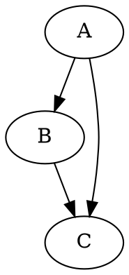

# 问题日志

<!--more-->

## IEEE754和binary32这种模式有什么区别

IEEE 754和binary32都是浮点数表示的标准。IEEE 754是一种用于表示浮点数的标准，它定义了浮点数的表示方法、运算规则等。而binary32是IEEE 754标准中的一种具体实现，也称为单精度浮点数，用32位（或4个字节）来表示一个浮点数。

主要区别在于，IEEE 754是一个标准，定义了多种浮点数的表示方式，包括单精度（binary32）、双精度（binary64）等。而binary32是这个标准中的一种特定实现，它使用32位来表示一个浮点数，其中1位表示符号位，8位表示指数，23位表示尾数。这种表示方式允许在一定范围内表示很大或很小的数字，并保持相对较高的精度。

简而言之，IEEE 754是浮点数表示的标准，而binary32是这个标准中的一种具体实现，用32位表示一个浮点数。

## IEEE754标准中都有哪些模式

IEEE 754标准定义了几种不同精度的浮点数表示方式，包括：

1. **单精度（binary32）：** 使用32位（4字节）来表示一个浮点数，其中1位表示符号，8位表示指数，23位表示尾数。

2. **双精度（binary64）：** 使用64位（8字节）来表示一个浮点数，其中1位表示符号，11位表示指数，52位表示尾数。

3. **拓展精度（extended precision）：** 使用80位或128位来表示一个浮点数，具体的位数可能因硬件和软件平台而异。这种格式在一些计算中常用，因为它提供了比双精度更高的精度。

此外，IEEE 754标准还定义了一些特殊值，包括正无穷大、负无穷大、NaN（Not a Number，表示非数值，用于表示无效的操作结果或未定义的数学运算）等。这些标准确保了在不同计算机系统之间的浮点数表示的一致性和可移植性。

## polynomial iteration翻译并解释

"Polynomial iteration" 可以翻译为 "多项式迭代"。

多项式迭代是一种数值计算方法，通常用于求解方程或寻找多项式的根。在多项式迭代中，你会从一个初始猜测值开始，然后使用多项式函数的迭代过程来逐步接近方程的解或多项式的根。这个过程会一次又一次地应用多项式函数，每次都使用上一次计算的结果作为下一次的输入，直到达到所需的精度或找到根为止。

多项式迭代在数学和工程领域中广泛应用，用于解决各种方程和问题，例如找到方程的实数或复数根，计算多项式的因子，以及进行数值优化等任务。它是数值分析和计算数学中的重要技术之一。

## conjugate gradient algorithm翻译并解释

"Conjugate Gradient Algorithm" 可以翻译为 "共轭梯度算法"。

共轭梯度算法是一种用于解决大规模线性方程组和优化问题的迭代数值算法。它通常用于解决对称正定矩阵的线性方程组，这类问题在科学和工程中经常出现，例如在计算机图形学、结构力学、机器学习等领域。

这个算法的核心思想是通过一系列迭代步骤来逼近线性方程组的解，每一步都通过利用共轭（conjugate）的方向来减小残差（residual）。共轭方向的选择保证了算法的高效性，因为它最大程度地减少了在解空间中寻找解的步骤。在每一步中，算法会更新当前解的位置，并计算一个共轭方向，然后朝着这个方向进行搜索，以最小化残差。

共轭梯度算法通常用于求解大规模稀疏矩阵的线性方程组，这些问题在许多科学和工程应用中都非常重要。它具有较好的收敛性和高效性，是解决这类问题的一种常用方法。

## 解释C++类成员函数的声明

```c++
/// \brief Copy assignment operator
  DotFormatter& operator=(const DotFormatter&) noexcept = default;
```

这是一个C++类成员函数的声明。我为你分步解释：

1. `/// \brief Copy assignment operator`
   - 这是一个Doxygen风格的注释。Doxygen是一个文档生成工具，它可以从源代码注释中生成文档。此注释说明下面的函数是一个拷贝赋值运算符。

2. `DotFormatter& operator=(const DotFormatter&) noexcept = default;`
   - `DotFormatter& operator=(const DotFormatter&)`：这是拷贝赋值运算符的声明。它接受一个常量引用`const DotFormatter&`作为参数，并返回`DotFormatter&`类型的引用，表示赋值后的对象的引用。
   - `noexcept`：这是一个C++11特性，表明此函数不会抛出异常。
   - `= default;`：这是一个C++11特性，表示使用编译器默认提供的拷贝赋值运算符的实现。也就是说，我们没有手动提供具体的实现，而是让编译器为我们生成默认的实现。

总体上，这行代码是在声明`DotFormatter`类的拷贝赋值运算符，并使用编译器默认的实现，并指明这个函数不会抛出异常。

```c++
/// \brief Move assignment operator
  DotFormatter& operator=(DotFormatter&&) noexcept = default;
```

这是一个C++类成员函数的声明，具体是声明了一个移动赋值运算符。我将为你逐步解释：

1. `/// \brief Move assignment operator`
   - 同样是一个Doxygen风格的注释，说明这是一个移动赋值运算符。

2. `DotFormatter& operator=(DotFormatter&&) noexcept = default;`
   - `DotFormatter& operator=(DotFormatter&&)`：这是移动赋值运算符的声明。它接受一个右值引用`DotFormatter&&`作为参数，并返回`DotFormatter&`类型的引用，代表赋值后的对象的引用。
   - `noexcept`：表示此函数不会抛出异常。
   - `= default;`：表示使用编译器默认提供的移动赋值运算符的实现。也就是说，没有手动提供具体的实现，而是让编译器为我们生成默认的实现。

总结：这行代码是在声明`DotFormatter`类的移动赋值运算符，并使用编译器的默认实现，并且指定这个函数不会抛出异常。移动赋值运算符通常用于实现资源的高效转移，特别是在对象间进行赋值操作时。

## C++中的移动构造函数是什么

在C++中，移动构造函数是C++11及以后版本中引入的一个新特性，它允许对象"窃取"另一个对象的资源，而不是通过复制这些资源来构造新对象。这通常用于优化临时对象的资源管理，从而提高程序的性能。

移动构造函数的核心思想是：有些对象拥有动态分配的内存或其他重要资源，当这些对象被用作临时对象或即将被销毁时，它们的资源可以安全地被其他对象获取，而不需要进行昂贵的深复制操作。

考虑一个简单的`std::string`类似的例子。一个字符串对象内部可能有一个动态分配的字符数组。当我们要从一个临时字符串对象（或即将被销毁的字符串对象）创建一个新的字符串对象时，我们可以简单地将原对象的内存指针移动到新对象，而不是复制整个字符数组。

以下是一个简化版的字符串类，展示了移动构造函数的用法：

```c++
class SimpleString {
private:
    char* data;
    size_t length;

public:
    // ... 其他构造函数和成员函数 ...

    // 移动构造函数
    SimpleString(SimpleString&& other) noexcept
        : data(other.data), length(other.length) {
        // 使原对象不再指向这块内存
        other.data = nullptr;
        other.length = 0;
    }

    // ... 其他成员函数 ...
};
```

在上述例子中，移动构造函数接受一个右值引用`SimpleString&&`，然后直接获取原字符串对象的内部指针，并将原对象的指针设置为`nullptr`，这样原对象在销毁时就不会释放这块内存。

值得注意的是，移动构造函数通常应该被标记为`noexcept`，因为它们经常用于容器的重新分配操作，而容器需要知道这些操作不会抛出异常。

总之，移动构造函数为C++提供了一个优化资源管理和对象创建的机制，特别是在涉及大量临时对象和资源转移的场景中。

## C++中的explicit关键字的作用

在C++中，`explicit`关键字是用来修饰构造函数的，确保该构造函数不会在不明确的情况下进行隐式类型转换。它的主要目的是防止意外的类型转换导致的错误。

为了更好地理解，让我们看一个例子。假设你有一个`Box`类，该类有一个接受整数参数的构造函数，表示盒子的大小：

```c++
class Box {
public:
    Box(int size) {
        // ... 实现 ...
    }
};

void displayBox(const Box& b) {
    // ... 显示盒子 ...
}
```

如果你没有使用`explicit`关键字，你可能会意外地这样使用：

```c++
displayBox(42);  // 隐式地将int转换为Box
```

在上述情况下，整数`42`被隐式地转换为一个`Box`对象，因为`Box`的构造函数允许这样的转换。

但是，这种隐式转换可能并不总是你期望的，尤其是在上述情境中，这种转换可能不够直观或容易引发错误。

为了防止这种隐式转换，你可以使用`explicit`关键字：

```c++
class Box {
public:
    explicit Box(int size) {
        // ... 实现 ...
    }
};
```

这样，以下代码就会引发编译错误，因为不允许隐式类型转换：

```c++
displayBox(42);  // 编译错误：不能隐式地将int转换为Box
```

要使用`Box`构造函数，你必须明确地进行转换：

```c++
displayBox(Box(42));  // OK
```

总之，`explicit`关键字用于防止可能导致误解或错误的隐式类型转换。使用这个关键字可以使你的代码更安全、更清晰。

## `std::ostream&`是什么

`std::ostream`是C++标准库中的一个重要类，它属于C++的输入/输出流库。`std::ostream`主要用于数据的输出操作，例如将数据写入到屏幕（通过`std::cout`）或写入到文件（通过`std::ofstream`对象）。

在你给出的代码中，`std::ostream&`是一个对`std::ostream`对象的引用。当一个函数接受一个`std::ostream&`作为参数，这意味着你可以传递任何`std::ostream`对象（或其派生类的对象）到该函数，如`std::cout`（用于控制台输出）或`std::ofstream`对象（用于文件输出）。

使用引用参数允许函数直接在提供的流上操作，而不是复制它。这也意味着在函数内部对流所做的任何操作（例如写入数据）都会直接影响到传递给它的实际流对象。

在`TextFormatter`类的`format`方法中，`std::ostream&`参数通常用于指定输出的目标，无论是屏幕、文件还是其他输出媒介。

## Graphviz是什么

Graphviz（Graph Visualization Software）是一个开源的图形可视化软件包。它用于表示结构化信息为图形和网络图。其核心组件是`dot`语言，这是一种简单的描述图的文本语言，以及众多的工具，如`dot`、`neato`、`twopi`、`circo`等，这些工具可以根据`dot`语言描述的图生成各种格式的可视化输出。

以下是一个简单的DOT语言示例，描述了一个有向图：

这描述了一个有三个节点（A、B和C）和三条边的图。

Graphviz的主要优点之一是其自动布局功能，它能够自动计算图中节点的位置，使得图看起来整洁，并突出显示图的结构，而不需要手动调整每个节点的位置。

在很多应用场景中，Graphviz都非常有用，例如编译器优化的数据流分析、网络结构可视化、软件的依赖关系分析等。

## ubuntu命令行打开图片

打开图片：
解决办法：ubuntu系统中图片有对应的默认打开程序，所以鼠标双击就可以打开图片，命令行中如果想打开图片，只要使用图片默认的程序去打开它就可以了。ubuntu提供一个命令xdg-open，此命令后面接你想打开的文件、图片、视频、音乐等，都可以。此命令就会使用默认的程序去打开后面接的文件。比如图片名为xxx.jpg，那么在命令行中输入:

```sh
xdg-open xxx.jpg
```

详情请见：[ubuntu中命令打开图片、文档、音乐、视频等_在ubuntu中输入命令显示图片-CSDN博客](https://blog.csdn.net/weixin_44493841/article/details/106093697)

## 解释并举例C++中的复制构造函数、移动构造函数、复制赋值运算符、移动赋值运算符和析构函数。

当然可以！

**1. 复制构造函数 (Copy Constructor)**
用于初始化一个对象为另一个对象的副本。
```c++
class MyClass {
public:
    MyClass(const MyClass& other) {
        // ... copy the contents from 'other' to 'this'
    }
};
```
举例:
```c++
MyClass a;
MyClass b(a);  // 使用复制构造函数
```

**2. 移动构造函数 (Move Constructor)**
用于“窃取”一个对象的资源，而非复制。
```c++
class MyClass {
public:
    MyClass(MyClass&& other) noexcept {
        // ... move the contents from 'other' to 'this'
    }
};
```
举例:
```c++
MyClass a;
MyClass b(std::move(a));  // 使用移动构造函数
```

**3. 复制赋值运算符 (Copy Assignment Operator)**
当为一个已存在的对象赋值时使用。
```c++
class MyClass {
public:
    MyClass& operator=(const MyClass& other) {
        if (this != &other) {
            // ... copy the contents from 'other' to 'this'
        }
        return *this;
    }
};
```
举例:
```c++
MyClass a, b;
a = b;  // 使用复制赋值运算符
```

**4. 移动赋值运算符 (Move Assignment Operator)**
当为一个已存在的对象赋予另一个对象的资源时使用。
```c++
class MyClass {
public:
    MyClass& operator=(MyClass&& other) noexcept {
        if (this != &other) {
            // ... move the contents from 'other' to 'this'
        }
        return *this;
    }
};
```
举例:
```c++
MyClass a, b;
a = std::move(b);  // 使用移动赋值运算符
```

**5. 析构函数 (Destructor)**
当一个对象不再被使用并需要被销毁时调用。
```c++
class MyClass {
public:
    ~MyClass() {
        // ... release any resources or cleanup
    }
};
```
举例:
```c++
{
    MyClass a;  // 当离开这个范围时，a的析构函数将被调用
}
```

注意，为了实现资源安全的管理，通常使用规则：五/三/零，即如果你定义了移动构造函数或移动赋值运算符，你应该考虑定义所有五个；如果不需要移动语义，定义复制构造函数和复制赋值运算符；如果一个类不需要自定义析构函数、复制/move操作，那么最好全部都不定义，使用编译器自动生成的版本。

## /home/zou/Documents/FIKOS/ar/src/semantic 目录下的function.cpp文件中的Function::create函数

当然可以。`Function::create`是`ikos::ar::Function`类的一个静态工厂方法。这种方法通常用于创建对象，同时隐藏实例化对象的复杂性。我们来详细分析它。

```cpp
Function* Function::create(Bundle* bundle,
                           FunctionType* type,
                           std::string name,
                           bool is_definition,
                           Intrinsic::ID intrinsic_id) {
  auto fun =
      new Function(bundle, type, std::move(name), is_definition, intrinsic_id);
  bundle->add_function(std::unique_ptr< Function >(fun));
  return fun;
}
```

以下是对该方法的逐步分析：

1. **方法定义**：此方法定义表示我们希望创建并返回一个指向`Function`对象的指针。
   - `Bundle* bundle`: 表示该函数所属的"bundle"的指针。
   - `FunctionType* type`: 函数的类型。
   - `std::string name`: 函数的名称。
   - `bool is_definition`: 这是一个布尔标志，用于表示该函数是否是一个定义（相对于只是一个声明）。
   - `Intrinsic::ID intrinsic_id`: 表示内置函数ID的枚举值。

2. **创建`Function`对象**：
   ```cpp
   auto fun = new Function(bundle, type, std::move(name), is_definition, intrinsic_id);
   ```
   这里我们使用`new`关键字动态地分配一个新的`Function`对象。同时，我们通过`std::move(name)`移动语义来传递`name`字符串，这样可以优化性能，避免不必要的字符串拷贝。

3. **添加函数到`Bundle`**：
   ```cpp
   bundle->add_function(std::unique_ptr< Function >(fun));
   ```
   这里，我们将新创建的函数对象添加到给定的"bundle"中。为了管理这个动态创建的函数对象的生命周期，我们将它封装在`std::unique_ptr`中，这是一个智能指针，当其超出作用域时，它会自动删除所指向的对象。

4. **返回创建的`Function`对象的指针**：
   ```cpp
   return fun;
   ```
   虽然我们已经把`Function`对象的所有权交给了`std::unique_ptr`，但我们仍然返回一个裸指针给调用者，以便他们可以与新创建的对象互动。需要注意的是，这种方式存在一定的风险，因为调用者可能误认为他们需要删除返回的指针。然而，由于所有权已经被`unique_ptr`管理，所以实际上调用者不应该删除这个指针。

总的来说，`Function::create`方法提供了一个创建、初始化并添加`Function`对象到相应"bundle"的方式，同时确保其生命周期得到恰当的管理。

## /home/zou/Documents/FIKOS/ar/src/semantic 目录下的Function.cpp中的Function::set_name函数

当然可以。让我们来详细分析和解释`Function::set_name`方法。

```cpp
void Function::set_name(std::string new_name) {
  // In this case, we need to notify the bundle,
  // because it keeps a map from name to functions
  ikos_assert_msg(!new_name.empty(), "name is empty");
  std::string prev_name = this->name();

  if (!new_name.empty() && this->_parent->is_name_available(new_name)) {
    this->_name = std::move(new_name);
  } else {
    this->_name = this->_parent->find_available_name(new_name);
  }

  this->_parent->rename_function(this, prev_name, this->_name);
}
```

以下是对该方法的逐步分析：

1. **方法定义**:
   `Function::set_name`方法接受一个`std::string`类型参数`new_name`，用于为`Function`对象设置一个新名称。

2. **断言检查**:
   ```cpp
   ikos_assert_msg(!new_name.empty(), "name is empty");
   ```
   使用`ikos_assert_msg`进行断言，确保传入的`new_name`不是空的。

3. **保存当前名称**:
   ```cpp
   std::string prev_name = this->name();
   ```
   在修改名称之前，首先保存当前的函数名称，以便稍后在通知"_parent"（即"bundle"）时使用。

4. **检查新名称的可用性**:
   ```cpp
   if (!new_name.empty() && this->_parent->is_name_available(new_name)) {
       this->_name = std::move(new_name);
   } else {
       this->_name = this->_parent->find_available_name(new_name);
   }
   ```
   这段代码首先检查`new_name`是否非空，并通过`is_name_available`方法询问"_parent"（即"bundle"）该名称是否可用。如果名称可用，它将使用移动语义将`new_name`赋值给`_name`，以优化性能并避免不必要的字符串拷贝。如果名称不可用，它会通过`find_available_name`方法获取一个可用的名称。

5. **通知"_parent"（即"bundle"）**:
   ```cpp
   this->_parent->rename_function(this, prev_name, this->_name);
   ```
   `_parent`（即"bundle"）似乎维护了一个从函数名称到函数的映射。因此，当函数的名称发生变化时，需要通知其"_parent"，以更新这个映射。`rename_function`方法可能会负责这个更新任务，它需要知道函数对象、之前的名称和新的名称。

总的来说，`Function::set_name`方法允许你为`Function`对象重新命名，并确保与其关联的"_parent"（即"bundle"）更新其内部的映射，以保持一致性。

## /home/zou/Documents/FIKOS/ar/src/semantic 目录下的bundle.cpp文件的Bundle类的作用

`ikos::ar::Bundle`类在`ikos`中代表了一个程序或模块的顶级容器。在许多编译器框架和程序分析工具中，这种顶级容器的概念很常见，例如在LLVM中的`Module`。以下是`Bundle`类的主要功能和作用：

1. **容纳函数和全局变量**：`Bundle`充当了存放全局变量和函数定义的容器。从提供的源代码中可以看出，`Bundle`类提供了方法来添加、查找和重命名函数和全局变量。

2. **管理名称空间**：`Bundle`提供了一些方法，如`is_name_available`和`find_available_name`，来确保函数和全局变量的名称在整个`Bundle`中是唯一的。

3. **管理内建函数（Intrinsics）**：`Bundle`提供了`intrinsic_function`方法来获取或创建特定的内建函数。内建函数通常是编译器或分析工具中预定义的特殊函数，它们具有特定的行为或用途。

4. **持有数据布局和目标三元组信息**：构造函数接受一个`DataLayout`和一个目标三元组`triple`。`DataLayout`可能描述了目标架构的数据布局信息，如字节顺序、整数大小等。目标三元组通常描述了目标平台的信息，例如其架构、供应商和操作系统。

总的来说，`ikos::ar::Bundle`类是整个程序分析表示（Program Analysis Representation, AR）的根，存储了所有的全局变量、函数、以及与目标平台相关的信息。这使得分析工具可以在一个集中的位置访问和处理整个程序的信息。

## /home/zou/Documents/FIKOS/ar/src/semantic 目录下的bundle.cpp文件提供的intrinsic_function函数

当然可以。从您提供的`bundle.cpp`文件中，我们可以看到`Bundle`类提供了两个`intrinsic_function`方法。以下是这两个方法的分析：

### 1. `Function* Bundle::intrinsic_function(Intrinsic::ID id)`

**参数**：

- `Intrinsic::ID id`: 一个枚举类型，表示特定的内建函数。

**功能**：

- 首先，该方法使用`Intrinsic::long_name(id)`来获取内建函数的名称。
- 然后，它尝试在当前的`Bundle`中查找这个名称的函数。
- 如果找到，它就直接返回这个函数。
- 如果没有找到，它会使用`Intrinsic::type(this, id)`来获取函数的类型，并使用`Function::create`方法来创建一个新的函数，并添加到`Bundle`中。

### 2. `Function* Bundle::intrinsic_function(Intrinsic::ID id, Type* template_ty)`

**参数**：
- `Intrinsic::ID id`: 一个枚举类型，表示特定的内建函数。
- `Type* template_ty`: 一个额外的类型参数，某些内建函数可能会需要它。

**功能**：
- 类似于上一个方法，但是这个版本考虑了额外的类型参数`template_ty`。
- 使用`Intrinsic::long_name(id, template_ty)`来获取带有类型参数的内建函数的名称。
- 然后进行相同的查找或创建函数的操作。

**总结**：
`intrinsic_function`方法允许用户在`Bundle`中获取或创建特定的内建函数。这些内建函数在编译器和程序分析工具中通常是预定义的，并且它们具有特定的预期行为。例如，某些内建函数可能会表示特定的数学操作、内存操作或其他特殊的行为。

这两个版本的方法基本上执行相同的逻辑，只是其中一个版本额外处理了类型参数。这种模式在编译器和程序分析工具中很常见，因为一些内建函数可能会根据不同的类型参数有不同的行为或表示。

## /home/zou/Documents/FIKOS/ar/ar/semantic 目录下的instrinc.hpp文件分析

`ikos::ar::Intrinsic`类在`ikos`中似乎是用来管理和访问内建函数的。这些内建函数为编译器或分析工具提供了特定的、预定义的功能。

以下是对该类定义的详细分析：

### 1. 枚举`Intrinsic::ID`

这是一个枚举类型，定义了所有可用的内建函数。从列表中我们可以看到，这些函数大致可以分为几个分类：
- IKOS特定的内建函数：如`IkosAssert`、`IkosAssume`等。
- Libc函数：这些是C标准库函数的表示，如`LibcMalloc`、`LibcFree`、`LibcPrintf`等。
- Libcpp函数：这些代表C++库函数，如`LibcppNew`和`LibcppDelete`。

### 2. 常量`Prefix`

定义了内建函数名称的前缀，其值为`"ar."`。

### 3. 类方法

- `FunctionType* type(Bundle*, ID)`: 从内建函数的ID获取其类型。
  
- `FunctionType* type(Bundle*, ID, Type*)`: 对于需要类型参数的内建函数，获取其类型。

- `std::string short_name(ID)`: 根据内建函数的ID获取其简短名称。

- `std::string short_name(ID, Type*)`: 对于需要类型参数的内建函数，获取其简短名称。

- `std::string long_name(ID)`: 根据内建函数的ID获取其完整名称，这通常是简短名称与前缀的组合。

- `std::string long_name(ID, Type*)`: 对于需要类型参数的内建函数，获取其完整名称。

### 总结

`ikos::ar::Intrinsic`类为`ikos`提供了一种方法来识别、访问和管理内建函数。这些函数是预定义的，并且在编译或分析期间具有特定的预期行为。通过这个类，工具可以轻松地查询和使用这些函数，无需每次都定义它们。

该类还提供了方法来获取内建函数的名称和类型，这使得工具可以在不知道特定内建函数的确切信息的情况下与其交互。

如果您有关于这个类或其他方面的任何其他问题，请告诉我。

## /home/zou/Documents/FIKOS/ar/src/semantic 目录下的intrinsic.hpp文件中的Intrinsic类也包含分类

是的，`Intrinsic`类中的`ID`枚举确实有分类，我们可以从枚举值的命名看到。以下是这些分类的简要说明：

1. **IKOS特定的内建函数**：
   - 由`_BeginIkosIntrinsic`和`_EndIkosIntrinsic`包围。
   - 这些内建函数与IKOS的分析功能直接相关，例如`IkosAssert`、`IkosAssume`和`IkosNonDet`。

2. **Libc函数**：
   - 由`_BeginLibcIntrinsic`和`_EndLibcIntrinsic`包围。
   - 这些函数代表C语言标准库中的函数。例如，`LibcMalloc`、`LibcFree`和`LibcPrintf`。
   - 它们覆盖了各种标准C库功能，包括内存管理、文件I/O、字符串处理等。

3. **Libcpp函数**：
   - 由`_BeginLibcppIntrinsic`和`_EndLibcppIntrinsic`包围。
   - 这些函数代表C++标准库中的功能，如`LibcppNew`、`LibcppDelete`，以及异常处理函数如`LibcppThrow`和`LibcppBeginCatch`。

这种分类方式提供了一种结构化的方法来组织和理解这些内建函数，这对于开发者和用户来说都是有用的，因为它们可以根据功能或用途快速找到特定的内建函数。

## /home/zou/Documents/FIKOS/ar/src/semantic 目录下的intrinsic.cpp文件中的template_ty是什么

在您给出的代码片段和函数签名`std::string Intrinsic::short_name(ID id, Type* template_ty)`中，`template_ty`是一个指向`Type`的指针。从名字和上下文来看，这个参数可能是用来表示某些内建函数短名称中的模板类型。

例如，前面的列表中有像`ikos.nondet.(type)`这样的短名称。在这里，`(type)`可能是一个占位符，它将根据`template_ty`的实际类型来替换。假设`Type`类可以代表例如`int`、`float`等类型，那么`ikos.nondet.(type)`可能会被替换为`ikos.nondet.int`、`ikos.nondet.float`等。

这样的设计可以让内建函数名字更具描述性，同时根据实际类型动态生成。在处理涉及模板或泛型的情况时，这样的设计是非常有用的。

## /home/zou/Documents/FIKOS/ar/src/semantic 目录下的intrinsic.cpp文件中的case IkosNonDet是什么

这行代码是`Intrinsic::short_name`函数中的一部分，它是处理`IkosNonDet`情况的。

`IkosNonDet`似乎代表某种不确定的或非确定性的内建函数。当需要为这种函数生成短名称时，这个代码片段会根据提供的`template_ty`（一个代表某种类型的`Type`指针）生成名称。

函数`template_type_name(template_ty)`会返回`template_ty`的短名称字符串。这个名称随后会被拼接到`"ikos.nondet."`字符串后面。

例如，如果`template_ty`代表了整数类型（假设其名称为`int`），则上述代码会返回字符串`"ikos.nondet.int"`。这提供了一种动态生成描述性名称的方法，该名称基于内建函数的种类以及其操作的数据类型。

## /home/zou/Documents/ikos/core/include/ikos/core/support目录下的assert.hpp文件

这个`assert.hpp`文件定义了三个宏：`ikos_assert`、`ikos_assert_msg` 和 `ikos_unreachable`。这些宏的主要目的是帮助开发者在调试模式下检测问题，并在发布模式下确保没有额外的运行时开销。

1. **ikos_assert(expr)**: 这个宏用于断言一个表达式为真。如果在调试模式下（即NDEBUG未定义）该表达式为假，程序将中断。在发布模式下，这个宏没有任何效果。

2. **ikos_assert_msg(expr, msg)**: 这个宏与`ikos_assert`相似，但它还允许您提供一个错误消息。如果表达式为假，那么这个消息将与错误一起显示。同样，在发布模式下，这个宏没有任何效果。

3. **ikos_unreachable(msg)**: 这个宏标记了不应该达到的代码位置。如果这个位置被达到了，那么在调试模式下，它会导致一个断言失败。在发布模式下，根据编译器的支持，它可能会提供一个优化器提示，表示当前位置不可达，或者调用abort()函数来中断程序。

当NDEBUG宏被定义（通常在发布模式下），`ikos_assert`和`ikos_assert_msg`宏的实际效果就是不执行任何操作。而`ikos_unreachable`宏则可能提供一个给优化器的提示或调用abort()函数，具体取决于编译器的支持。

在调试模式下，这些宏使用了标准的`assert`函数来实现其断言功能。

## #undef怎么用

`#undef` 是 C 和 C++ 预处理器的一个指令，用于取消之前定义的宏。这意味着，当你使用 `#undef` 指令后，该宏的定义将被移除，它将不再是一个已定义的宏，直到再次被 `#define` 定义。

这里是一个简单的 `#undef` 使用示例：

```cpp
#define MY_MACRO 100

#include <iostream>

int main() {
    std::cout << MY_MACRO << std::endl; // 输出 100

    #undef MY_MACRO
    // 此时，MY_MACRO 不再被定义

    // 下面的代码将会引发编译错误，因为 MY_MACRO 已经未定义
    // std::cout << MY_MACRO << std::endl;
    
    #define MY_MACRO 200
    std::cout << MY_MACRO << std::endl; // 输出 200
}

```

`#undef` 的常见用途：

1. **移除宏定义**：有时，为了确保某个宏不会与其他代码冲突，或者确保在某个特定的区域中，该宏没有定义，你可能希望取消它的定义。
2. **重新定义宏**：如果你想给一个宏赋予一个新的值或定义，你首先需要取消它的原始定义，然后再重新定义它。

请注意，经常使用 `#undef` 可能会使代码难以阅读和维护，因为它可能会导致预期之外的宏行为，所以应该谨慎使用。

## #ifndef怎么用

`#ifndef` 是 C 和 C++ 预处理器的一个指令，它用于检查一个宏是否未被定义。如果该宏未被定义，则执行后续的预处理器指令，直到遇到对应的 `#endif`。

`#ifndef` 常常与 `#define` 一起使用，来避免头文件的多重包含。这种方法被称为 "include guards" 或 "header guards"。

下面是如何使用 `#ifndef` 的一个简单示例：

```cpp
// 文件：example_header.h

#ifndef EXAMPLE_HEADER_H
#define EXAMPLE_HEADER_H

// 头文件的内容
int my_function();

#endif // EXAMPLE_HEADER_H
```

这里的工作原理是：

1. 当这个头文件第一次被包含时，`EXAMPLE_HEADER_H` 还没有定义，所以 `#ifndef EXAMPLE_HEADER_H` 为真，预处理器会继续处理直到 `#endif`。
2. 在这个过程中，`#define EXAMPLE_HEADER_H` 将会执行，这样 `EXAMPLE_HEADER_H` 就被定义了。
3. 如果在后面的代码中再次包含这个头文件，`EXAMPLE_HEADER_H` 已经被定义，因此 `#ifndef EXAMPLE_HEADER_H` 为假，预处理器就会跳过整个块，直到 `#endif`。

这种方法有效地避免了由于多次包含相同的头文件而导致的重复定义。

## #ifdef怎么用

`#ifdef` 是 C 和 C++ 预处理器的一个指令，用于检查一个宏是否已经被定义。如果该宏已定义，那么 `#ifdef` 和其后的代码（直到相应的 `#endif`）之间的代码将会被包含在编译中。否则，该段代码会被忽略。

以下是一个简单的使用 `#ifdef` 的示例：

```cpp
#include <iostream>

#define USE_HELLO

int main() {
    #ifdef USE_HELLO
        std::cout << "Hello, World!" << std::endl;
    #else
        std::cout << "Hi, World!" << std::endl;
    #endif

    return 0;
}
```

在上述代码中，因为宏 `USE_HELLO` 已经被定义，所以程序将输出 "Hello, World!"。如果你注释掉 `#define USE_HELLO` 这一行，程序则会输出 "Hi, World!"。

`#ifdef` 的常见用途：

1. **平台或编译器特定的代码**：可以根据不同的平台或编译器定义不同的宏，然后使用 `#ifdef` 来编写特定于该平台或编译器的代码。

2. **功能切换**：在开发过程中，你可能想要在不同的版本或构建选项之间切换某些功能。通过定义或不定义某个宏，可以轻松地启用或禁用特定的代码段。

3. **头文件保护**：为了防止一个头文件被多次包含，可以使用 `#ifdef`、`#define` 和 `#endif` 的组合来确保头文件的内容只被包含一次。

除了 `#ifdef`，还有 `#ifndef` 指令，它的作用是检查一个宏是否*没有*被定义。如果该宏未定义，那么 `#ifndef` 和其后的代码（直到相应的 `#endif`）之间的代码将会被包含在编译中。

## /home/zou/Documents/ikos/ar/include/ikos/semantic 目录下的type.hpp文件

这是`type.hpp`文件的内容概要，它定义了IKOS (Interval-based Klee Open Solver) 中的各种类型。

1. **头文件和前置声明**:
   - 包含了标准库头文件、其他IKOS组件等。
   - 定义了一些前置声明，比如`Bundle`和`Context`。

2. **FloatSemantic枚举**: 描述了不同的浮点数语义，如半精度、单精度、双精度等。

3. **Type类**:
   - 基类，表示所有类型。
   - 定义了类型的各种种类，如整型、浮点型、指针类型、结构体类型等。
   - 提供了一系列的方法来查询特定类型的信息。

4. **VoidType类**: 表示C语言中的`void`类型。

5. **ScalarType类**: 表示标量类型的基类，如整型、浮点型和指针。

6. **IntegerType类**: 
   - 表示整数类型。
   - 除了基本的整数类型，还支持不同的位宽和符号性。

7. **FloatType类**: 表示浮点类型，支持不同的浮点语义。

8. **PointerType类**: 表示指针类型，具有指向的类型属性。

9. **AggregateType类**: 是StructType, ArrayType, VectorType和OpaqueType的基类。

10. **StructType类**: 
   - 表示结构体类型。
   - 可以包含多个字段，每个字段有一个偏移量和一个类型。

11. **SequentialType类**: 是数组和向量类型的基类。

12. **ArrayType类**: 表示数组类型。

13. **VectorType类**: 表示向量类型。

14. **OpaqueType类**: 表示不透明类型，主要用于表示C中的前向声明结构。

15. **FunctionType类**: 表示函数类型，具有返回类型和参数类型。

这个文件为IKOS提供了一个类型系统，可以表示大多数在中间表示(IR)中常见的类型。这些类型包括标量类型、聚合类型(如结构体和数组)以及函数类型。

这是一个C++项目中的类型定义文件，其中包含了一些类和枚举用于表示不同类型的数据。

1. **FloatSemantic 枚举**:
   - 包括 Half, Float, Double, X86_FP80, FP128, PPC_FP128，表示浮点数的语义。

2. **Type 类**:
   - 是所有类型的基类，包括了各种类型的共同特性和方法。

3. **TypeKind 枚举**:
   - 定义了不同类型的种类，如IntegerKind, FloatKind, PointerKind等。

4. **各种具体类型**:
   - `VoidType`, `IntegerType`, `FloatType`, `PointerType`, `StructType`, `ArrayType`, `VectorType`, `OpaqueType`, `FunctionType`，它们分别表示了不同种类的类型。

   - 每种类型都有相应的构造函数和静态方法用于获取实例。

   - 每种类型都有相应的方法用于查询其特性，比如是否是整数类型，浮点类型，指针类型等。

   - `ScalarType` 是所有标量类型的基类，包括 `IntegerType` 和 `FloatType`。

   - `AggregateType` 是所有聚合类型的基类，包括 `StructType`, `ArrayType`, `VectorType` 和 `OpaqueType`。

   - `SequentialType` 是所有顺序类型的基类，包括 `ArrayType` 和 `VectorType`。

   - `FunctionType` 表示函数类型，包括返回类型和参数类型。

5. **Context 类**:
   - 类型的创建和管理都需要一个上下文环境，`Context` 提供了相应的功能。

6. **各种构造函数和静态方法**:
   - 这些方法用于创建各种类型的实例，比如 `IntegerType::get` 用于创建整数类型的实例。

7. **其他方法**:
   - 每种类型还有一些特定的方法，如 `dump` 方法用于调试目的。

这个文件主要定义了用于表示各种类型的类和枚举，并提供了相应的方法来操作这些类型。同时也包含了一些静态方法来获取特定类型的实例。

## /home/zou/Documents/ikos/ar/include/ikos/semantic 目录下的type.hpp文件中的FloatType类的分析

当然可以。下面是对`FloatType`类的详细分析：

```cpp
/// \brief Floating point type
///
/// Represents any floating point type, with its bit-width and semantic.
///
/// See `FloatSemantic`.
class FloatType final : public ScalarType {
private:
  // Bit width
  uint64_t _bit_width;

  // Float semantic
  FloatSemantic _float_sem;

private:
  /// \brief Private constructor
  FloatType(uint64_t bit_width, FloatSemantic float_sem);

public:
  /// \brief Static constructor
  static FloatType* get(Context& ctx, FloatSemantic float_sem);

  /// \brief Get the bit width
  uint64_t bit_width() const { return this->_bit_width; }

  /// \brief Get the float semantic
  FloatSemantic float_semantic() const { return this->_float_sem; }

  /// \brief Dump the type for debugging purpose
  void dump(std::ostream&) const override;

  /// \brief Method for type support (isa, cast, dyn_cast)
  static bool classof(const Type* t) { return t->kind() == FloatKind; }

  // friends
  friend class ContextImpl;

}; // end class FloatType
```

`FloatType`类表示浮点数类型，并从`ScalarType`类继承。

1. **私有成员变量**:
   - `_bit_width`: 一个`uint64_t`类型，表示该浮点类型的位宽。
   - `_float_sem`: 一个`FloatSemantic`枚举类型，表示浮点数的语义，如单精度、双精度等。

2. **私有构造函数**:
   - `FloatType(uint64_t bit_width, FloatSemantic float_sem)`: 它是一个私有构造函数，这意味着不能直接实例化`FloatType`对象。它需要两个参数：位宽和浮点数语义。

3. **公共方法**:
   - `static FloatType* get(Context& ctx, FloatSemantic float_sem)`: 静态构造函数，使用给定的浮点数语义从上下文中获取或创建一个`FloatType`对象。
   - `uint64_t bit_width() const`: 返回该浮点类型的位宽。
   - `FloatSemantic float_semantic() const`: 返回浮点数的语义。
   - `void dump(std::ostream&) const override`: 用于调试目的，将类型信息转储到输出流中。
   - `static bool classof(const Type* t)`: 用于类型支持，检查给定的类型`t`是否为`FloatType`。

4. **友元类**:
   - `friend class ContextImpl`: 这使得`ContextImpl`类可以访问`FloatType`的私有和受保护的成员。

总的来说，`FloatType`类为IKOS提供了对不同浮点数语义的支持，如半精度、单精度、双精度等，每种浮点数语义都有相应的位宽。

## /home/zou/Documents/ikos/ar/include/ikos/semantic 目录下的type.hpp文件中的FloatSemantic类型

`FloatSemantic`是一个枚举类型，用于表示浮点数的不同语义。从你给出的代码中，我们可以看到以下定义：

```cpp
/// \brief Floating point semantic
enum FloatSemantic { Half, Float, Double, X86_FP80, FP128, PPC_FP128 };
```

下面是各个枚举值的解释：

1. **Half**: 半精度浮点数。它通常使用16位表示，其中有1位符号位、5位指数和10位尾数。

2. **Float**: 单精度浮点数。它通常使用32位表示，其中有1位符号位、8位指数和23位尾数。这是C/C++中的`float`类型。

3. **Double**: 双精度浮点数。它通常使用64位表示，其中有1位符号位、11位指数和52位尾数。这是C/C++中的`double`类型。

4. **X86_FP80**: 这是x86架构特有的80位扩展精度浮点数。通常有1位符号位、15位指数和64位尾数。

5. **FP128**: 128位四倍精度浮点数。具体的位分配可能因实现而异。

6. **PPC_FP128**: 这是PowerPC架构特有的128位双倍精度浮点数。

该枚举用于区分不同的浮点数表示，尤其是当需要确切知道浮点数的位宽和语义时，例如在代码生成、优化或分析中。

## /home/zou/Documents/ikos/ar/include/ikos/semantic 目录下的type.cpp中的Type::is_unsigned_integer函数

这是`Type`类中的`is_unsigned_integer()`方法的实现。该方法的目的是检查一个`Type`对象是否代表一个无符号整数类型。

让我们一步步地分析这个方法：

1. `isa< IntegerType >(this)`:
   - 这是一个模板函数，检查`this`对象是否是`IntegerType`类的一个实例。换句话说，它检查这个`Type`对象是否代表一个整数类型。

2. `cast< IntegerType >(this)->is_unsigned()`:
   - 如果`this`对象是一个`IntegerType`的实例，`cast< IntegerType >(this)`会将`this`对象安全地转换为`IntegerType`的指针。
   - `is_unsigned()`是`IntegerType`类的一个方法，它检查这个整数类型是否是无符号的。

3. 组合上面两个表达式，我们得到：
   - 如果这个`Type`对象是一个`IntegerType`的实例，并且它是无符号的，那么这个方法返回`true`，否则返回`false`。

总之，这个方法检查给定的`Type`对象是否代表一个无符号整数类型。如果是，返回`true`，否则返回`false`。

## /home/zou/Documents/ikos/ar/include/ikos/semantic 目录下的type.hpp中的Type类声明了什么

`Type`类在这段代码中代表一个基本的抽象类型。所有的具体类型，如整数、浮点数、向量等，都继承自这个基类。在`type.cpp`中，我们可以看到`Type`类的一些实现细节：

1. **构造函数**:
```cpp
Type::Type(TypeKind kind) : _kind(kind) {}
```
这个构造函数只接受一个`TypeKind`枚举作为参数，这个枚举描述了这个类型的种类，例如整数、浮点数等。

2. **析构函数**:
```cpp
Type::~Type() = default;
```
`Type`的析构函数被设为默认，意味着当`Type`对象被销毁时，不需要额外的清理工作。

3. **查询方法**:
这些方法允许查询给定类型的某些属性。
```cpp
bool Type::is_unsigned_integer() const { ... }
bool Type::is_signed_integer() const { ... }
bool Type::is_primitive() const { ... }
uint64_t Type::primitive_bit_width() const { ... }
```

4. **ctx_impl**:
这是一个辅助函数，返回给定上下文的实现。
```cpp
ContextImpl& Type::ctx_impl(Context& ctx) { ... }
```

这些就是`Type`类在`type.cpp`中的主要声明和实现。它主要是作为其他具体类型的基类，提供了一些基本的查询方法。

## /home/zou/Documents/FIKOS/ar/src/semantic 目录下的bundle.cpp文件中的create函数

`Bundle::create` 是一个静态成员函数，用于创建一个新的 `Bundle` 对象。

```cpp
Bundle* Bundle::create(Context& ctx,
                       std::unique_ptr< DataLayout > data_layout,
                       std::string triple) {
  Bundle* bundle = new Bundle(ctx, std::move(data_layout), std::move(triple));
  ctx._impl->add_bundle(std::unique_ptr< Bundle >(bundle));
  return bundle;
}
```

让我为你解释一下这个函数的具体步骤：

1. `Bundle* Bundle::create(Context& ctx, std::unique_ptr< DataLayout > data_layout, std::string triple)` 是一个静态成员函数，因此可以通过 `Bundle::create(...)` 的方式调用，而不需要先实例化一个 `Bundle` 对象。

2. 当调用 `Bundle::create` 时，它接受三个参数：
   - `ctx` 是一个 `Context` 的引用，表示上下文对象。
   - `data_layout` 是一个指向 `DataLayout` 对象的独占指针（unique_ptr）。
   - `triple` 是一个字符串，用于初始化 `Bundle` 对象的 `_target_triple` 成员。

3. 在函数内部，首先通过 `new` 运算符在堆上创建了一个新的 `Bundle` 对象，并使用传入的参数对其进行初始化。这个对象的指针被赋值给了 `bundle`。

4. 接着，通过 `ctx._impl->add_bundle(...)` 将新创建的 `Bundle` 对象添加到了 `Context` 的内部实现中。

5. 最后，函数返回了指向新创建的 `Bundle` 对象的指针。

总的来说，`Bundle::create` 函数的目的是创建一个新的 `Bundle` 对象，并将其添加到相应的 `Context` 中，然后返回指向该新对象的指针。

## /home/zou/Documents/FIKOS/ar/src/semantic 目录下的bundle.cpp文件中的std::unique_ptr< DataLayout > data_layout怎么用

`std::unique_ptr<DataLayout>` 是一个智能指针，用于管理一个 `DataLayout` 对象的所有权。智能指针允许你自动管理对象的生命周期，当不再需要时，会自动释放资源，防止内存泄漏。以下是如何使用 `std::unique_ptr<DataLayout>` 的示例：

首先，创建一个 `DataLayout` 对象，并将其包装在 `std::unique_ptr` 中：

```cpp
std::unique_ptr<DataLayout> dataLayoutPtr = std::make_unique<DataLayout>("your_data_layout_string");
```

在这个示例中，我们使用 `std::make_unique` 函数创建了一个 `DataLayout` 对象，并将其所有权分配给了 `dataLayoutPtr`。

接下来，你可以通过 `dataLayoutPtr` 访问 `DataLayout` 对象的方法和成员变量，就像直接操作 `DataLayout` 对象一样：

```cpp
// 访问 DataLayout 对象的方法
std::string alignment = dataLayoutPtr->getAlignmentInfo();
unsigned pointerSize = dataLayoutPtr->getPointerSize();

// 修改 DataLayout 对象的成员变量
dataLayoutPtr->setAlignmentInfo("new_alignment_info");
```

当不再需要 `DataLayout` 对象时，不需要手动释放内存，因为 `std::unique_ptr` 会在其超出范围时自动销毁对象并释放内存。例如，当 `dataLayoutPtr` 超出其作用域时，关联的 `DataLayout` 对象将被销毁：

```cpp
// dataLayoutPtr 超出作用域，关联的 DataLayout 对象会被销毁
```

这种方式可以帮助你避免内存泄漏问题，因为 `std::unique_ptr` 会在适当的时候自动释放资源。

说白了就是一个指针，但是能够在不需要的时候自动释放内存。

## /home/zou/Documents/FIKOS/ar/src/semantic 目录下的bundle.cpp文件中的SymbolTable怎么用

`SymbolTable< GlobalVariable > _globals;` 是 `Bundle` 类的一个私有成员变量，用于存储 `GlobalVariable` 对象的符号表。

让我为您解释一下：

- `_globals` 是一个名为 `_globals` 的成员变量，它的类型是 `SymbolTable< GlobalVariable >`。它实际上是一个符号表，用于存储全局变量对象。

- `SymbolTable` 可能是一个模板类，接受一个模板参数，这里是 `GlobalVariable` 类型。它提供了一种将符号与对象关联起来的机制，使得可以通过符号来查找、插入、删除对应的对象。

总的来说，`_globals` 成员变量是用于存储 `GlobalVariable` 对象的符号表，这样 `Bundle` 对象可以有效地管理全局变量。

## /home/zou/Documents/FIKOS/ar/src/semantic  目录下的symbol_table.hpp文件

`SymbolTable` 类的主要作用是管理符号（symbols）的集合。在编译器或解释器的上下文中，符号通常指代程序中的变量、函数、类型等命名实体。

以下是 `SymbolTable` 的主要功能：

1. **存储符号：** `SymbolTable` 使用 `std::unordered_map` 存储符号的名称与其对应的指针。这样，通过符号的名称可以快速检索到相应的符号。

2. **添加符号：** 提供了 `add` 函数，用于向符号表中添加新的符号。在添加之前，会检查符号的名称是否已经存在，以确保符号表中的每个符号都有唯一的名称。

3. **重命名符号：** 提供了 `rename` 函数，用于将符号在符号表中的名称修改为新的名称。同样，会进行一些检查以确保新的名称是唯一的。

4. **迭代符号：** 使用 `boost::transform_iterator` 提供了迭代器，允许用户遍历符号表中的符号，而无需直接处理底层的键值对。

5. **查询符号：** 提供了 `find` 函数，通过符号的名称查找符号在符号表中的指针。同时，提供了 `contains` 函数，用于检查符号表中是否包含特定名称的符号。

总体而言，`SymbolTable` 提供了一种组织和管理程序中命名实体的机制。这在编译器、解释器和其他静态或动态分析工具中是常见的需求。通过使用符号表，可以更方便地处理程序中的符号，并进行一些必要的操作，如重命名、检索、迭代等。

## /home/zou/Documents/FIKOS/ar/src/semantic 目录下的bundle.cpp文件中有什么函数

`Bundle` 类中定义了一些函数，以下是这些函数的简要解释：

1. `create`（静态构造函数）：
   - 作用：创建一个新的 `Bundle` 实例。
   - 参数：接受AR上下文、数据布局和目标三元组作为参数。
   - 返回：新的 `Bundle` 实例。
   - 解释：这个函数用于创建 `Bundle` 的新实例，它确保了 `Bundle` 的正确初始化。

2. `context`：
   - 作用：返回与 `Bundle` 相关联的AR上下文。
   - 返回：AR上下文的引用。
   - 解释：这个函数返回了 `Bundle` 中使用的AR上下文，这个上下文包含了关于程序的各种信息。

3. `data_layout`：
   - 作用：返回 `Bundle` 中定义的数据布局。
   - 返回：数据布局的引用。
   - 解释：这个函数返回了描述数据布局的对象，数据布局包括有关数据类型如何在内存中排列的信息。

4. `target_triple`：
   - 作用：返回 `Bundle` 中保存的目标三元组。
   - 返回：目标三元组的字符串。
   - 解释：这个函数返回了用于指定生成的目标代码的目标架构和操作系统的字符串。

5. `global_begin` 和 `global_end`：
   - 作用：用于遍历 `Bundle` 中全局变量的迭代器的起始和结束位置。
   - 返回：全局变量迭代器的起始和结束位置。
   - 解释：这对函数允许你遍历 `Bundle` 中的全局变量，以便查看或修改它们。

6. `num_globals`：
   - 作用：返回 `Bundle` 中全局变量的数量。
   - 返回：全局变量的数量。
   - 解释：这个函数返回 `Bundle` 中全局变量的数量。

7. `global_or_null`：
   - 作用：通过名称获取全局变量的指针，如果不存在则返回空指针。
   - 参数：要查找的全局变量的名称。
   - 返回：全局变量的指针或空指针。
   - 解释：这个函数允许你根据名称查找 `Bundle` 中的全局变量。

8. `function_begin` 和 `function_end`：
   - 作用：用于遍历 `Bundle` 中函数的迭代器的起始和结束位置。
   - 返回：函数迭代器的起始和结束位置。
   - 解释：这对函数允许你遍历 `Bundle` 中的函数，以便查看或修改它们。

9. `num_functions`：
   - 作用：返回 `Bundle` 中函数的数量。
   - 返回：函数的数量。
   - 解释：这个函数返回 `Bundle` 中函数的数量。

10. `intrinsic_function`：
    - 作用：获取或创建具有给定ID和（可选）类型参数的内部函数。
    - 参数：内部函数的ID和可选的类型模板。
    - 返回：内部函数的指针。
    - 解释：这个函数用于获取或创建具有特定内部ID的内部函数，用于内部操作和编译器优化。

11. `function_or_null`：
    - 作用：通过名称获取函数的指针，如果不存在则返回空指针。
    - 参数：要查找的函数的名称。
    - 返回：函数的指针或空指针。
    - 解释：这个函数允许你根据名称查找 `Bundle` 中的函数。

12. `is_name_available` 和 `find_available_name`：
    - 作用：用于检查名称是否可用以及查找可用的名称。
    - 参数：要检查的名称或查找的名称前缀。
    - 返回：`is_name_available` 返回布尔值，`find_available_name` 返回新的可用名称。
    - 解释：这些函数用于处理名称冲突，确保全局变量和函数的名称唯一性。

这些函数为 `Bundle` 类提供了管理全局变量、函数和与程序分析相关的信息的方法。

## /home/zou/Documents/FIKOS/ar/src/semantic 目录下的value.cpp文件

这是一个C++文件，涉及了一些与程序分析和编译相关的类，主要包括 `Value` 类和与值相关的各种常量、变量类。以下是该文件中的一些重要内容：

1. `Value` 类：这是表示各种值的基类，包括常量和变量。它包括一个值的种类（`ValueKind`）和类型（`Type`）信息。`Value` 类有一些派生类，如 `Constant`、`Variable` 等。

2. 常量类：包括 `UndefinedConstant`（未定义常量）、`IntegerConstant`（整数常量）、`FloatConstant`（浮点数常量）等。每个常量类都有相应的构造函数和 `dump` 方法，用于创建和打印常量。

3. 变量类：包括 `GlobalVariable`（全局变量）、`LocalVariable`（局部变量）和 `InternalVariable`（内部变量）。这些变量类表示程序中的各种变量。`GlobalVariable` 和 `LocalVariable` 具有名称、类型和其他信息，而 `InternalVariable` 通常是编译器内部使用的。

4. 全局变量类（`GlobalVariable`）：表示程序中的全局变量，包括名称、类型、是否定义等信息。它还包括一些与全局变量相关的方法，如 `create` 用于创建全局变量，`set_name` 用于设置名称，以及 `dump` 用于打印信息。

5. 局部变量类（`LocalVariable`）：表示程序中的局部变量，类似于全局变量，但通常在函数内部定义。也包括与局部变量相关的方法和打印信息的函数。

6. 内部变量类（`InternalVariable`）：表示程序中的内部变量，通常由编译器生成。它也包括与内部变量相关的方法和打印信息的函数。

这个文件主要定义了这些类，以及它们之间的关系和方法。这些类在程序分析和编译过程中用于表示和处理各种值和变量。如果你有特定的问题或需要深入了解其中的某个方面，请告诉我，我会尽力提供更多信息。

## /home/zou/Documents/ar/ikos/include/semantic 目录下的number.hpp文件

这是一个标题为“Number definitions”的C++头文件，它定义了一些与数字和整数操作相关的类和类型。以下是文件的主要内容：

1. 头文件包含：该文件包含了一些与整数操作相关的其他头文件，如 `supported_integral.hpp`、`z_number.hpp` 和 `machine_int.hpp`。这些头文件可能定义了一些整数和数字操作的具体实现。

2. 类型定义：文件定义了以下类型和类别：

   - `Signedness`：表示整数的符号（有符号或无符号）的枚举类型。
   - `Signed`：符号为有符号的整数值。
   - `Unsigned`：符号为无符号的整数值。
   - `ZNumber`：用于表示无限精度整数的类，这是一个支持任意精度的整数类。
   - `MachineInt`：用于表示任意精度机器整数的类，支持不同精度和符号。

这些定义用于处理各种整数和数字操作，包括整数运算、符号处理以及其他与整数相关的计算。这些类和类型可能在程序分析、编译器和其他需要数值处理的应用中起到关键作用。

## 用IKOS分析C程序的流程如下

```sh
zou@zou-VirtualBox:~/Documents/FIKOS/test/mytest$ ikos hello.c
[*] Compiling hello.c
[*] Running ikos preprocessor
[*] Running ikos analyzer
[*] Translating LLVM bitcode to AR
[*] Running liveness analysis
[*] Running widening hint analysis
[*] Running interprocedural value analysis
[*] Analyzing entry point 'main'
[*] Checking properties for entry point 'main'

# Time stats:
clang        : 0.032 sec
ikos-analyzer: 0.007 sec
ikos-pp      : 0.007 sec

# Summary:
Total number of checks                : 3
Total number of unreachable checks    : 0
Total number of safe checks           : 3
Total number of definite unsafe checks: 0
Total number of warnings              : 0

The program is SAFE

# Results
No entries.

```

## 解读Python脚本

```python
    parser.add_argument('-v',
                        dest='verbosity',
                        help='Increase verbosity',
                        action='count',
                        default=1)
```

这段代码是使用 Python 的 argparse 模块创建命令行参数解析器。它定义了一个名为 `-v` 或 `--verbosity` 的参数，用于控制输出的详细程度。参数的具体解释如下：

- `dest='verbosity'`：将解析后的值存储在名为 `verbosity` 的变量中。
- `help='Increase verbosity'`：当用户运行脚本时，如果使用了 `-h` 或 `--help` 参数，将显示的帮助信息，说明这个参数的作用是增加详细程度。
- `action='count'`：指定了当这个参数出现时的行为。在这种情况下，`action='count'` 表示每次出现 `-v` 就增加 `verbosity` 变量的值。例如，`-v` 会使 `verbosity` 变为2，`-vv` 会使其变为3，以此类推。
- `default=1`：如果用户没有提供 `-v` 参数，将使用默认值1。

这段代码的作用是允许用户通过命令行控制脚本的输出详细程度，通过多次使用 `-v` 参数来增加详细级别。

## 上述的代码怎么调用函数实现功能

在使用这个参数解析器的脚本中，你可以通过以下方式来调用相关函数：

1. **导入 argparse 模块：**
   ```python
   import argparse
   ```

2. **创建 ArgumentParser 对象：**
   ```python
   parser = argparse.ArgumentParser()
   ```

3. **添加参数：**
   ```python
   parser.add_argument('-v', dest='verbosity', help='Increase verbosity', action='count', default=1)
   ```

4. **解析命令行参数：**
   ```python
   args = parser.parse_args()
   ```

5. **使用解析后的参数：**
   ```python
   if args.verbosity == 1:
       print("Low verbosity output")
   elif args.verbosity == 2:
       print("Medium verbosity output")
   elif args.verbosity >= 3:
       print("High verbosity output")
   ```

这样，当用户在命令行中使用 `-v` 参数时，`args.verbosity` 将包含相应的值，你可以根据这个值来实现不同的功能。例如，你可以根据 `verbosity` 的不同级别输出不同详细程度的信息。

## Python脚本中的metavar和help关键词

```python
    parser.add_argument('-o', '--output-db',
                        dest='output_db',
                        metavar='<file>',
                        help='Output database file (default: output.db)',
                        default='output.db')
```

这段代码是用于解析命令行参数的 argparse 代码，针对输出数据库文件的设置。下面是对这段代码的解释：

- `-o` 和 `--output-db` 是两种不同的方式来指定输出数据库文件的参数，用户可以选择其中一种来使用。
- `dest='output_db'` 表示解析后的值将存储在名为 `output_db` 的变量中。
- `metavar='<file>'` 用于指定在帮助消息中显示的参数值的名称，这里是 `<file>`。
- `help='Output database file (default: output.db)'` 提供了在用户请求帮助时显示的信息，指明了这个参数的作用以及默认值。
- `default='output.db'` 指定了参数的默认值，如果用户未提供输出数据库文件的参数，则将使用这个默认值。

用户可以通过命令行指定输出数据库文件的名称，例如 `-o custom_db.db` 或 `--output-db custom_db.db`。如果用户未指定，将使用默认的输出数据库文件名 `output.db`。在脚本中，你可以通过 `args.output_db` 访问解析后的输出数据库文件的值。

上面的metavar是怎么用的?

`metavar` 是 argparse 模块中的一个参数，用于指定在帮助消息中显示的参数值的名称。它通常用于提供用户在命令行中应该提供什么样的值。

在你提供的代码中，`metavar='<file>'` 表示用户在命令行中指定输出数据库文件参数时，应该提供一个文件名。这个文件名在帮助消息中被称为 `<file>`，用于说明用户应该提供一个文件的路径作为参数值。

例如，当用户运行脚本时使用 `-o custom_db.db` 或 `--output-db custom_db.db`，帮助消息可能会包含类似以下的信息：

```sh
-o <file>, --output-db <file>		Output database file (default: output.db)
```

这样的帮助消息有助于用户理解该参数的期望值。

## argparse库中的action字段的多个选项

`argparse`库中的`action`字段有多种可选项，用于定义当命令行选项出现时应该执行的操作。以下是一些常见的`action`选项：

1. `store`（默认值）：将命令行参数的值存储在一个变量中。

2. `store_const`：存储一个常数值在一个变量中，通常与`const`参数一起使用。

3. `store_true`：存储`True`值在一个变量中，通常用于标志选项。

4. `store_false`：存储`False`值在一个变量中，也通常用于标志选项。

5. `append`：将多个参数值存储在一个列表中，用于多次出现的选项。

6. `append_const`：将一个常数值附加到一个列表中，通常与`const`参数一起使用。

7. `count`：计算选项出现的次数，存储在一个整数变量中，用于计数操作。

8. `version`：用于显示版本信息并退出。

这些`action`选项允许您自定义如何处理不同类型的命令行参数，以满足您的应用程序的需求。

## 命令行中可选参数值

`choices=args.choices(args.log_levels)`

这行代码涉及到 `args.choices` 函数，它似乎用于从命令行参数的可选值列表中获取选项的可选值。在这个特定上下文中，`args.log_levels` 应该是一个包含可选日志级别的列表。这行代码的目的是使用 `args.choices` 函数将这些可选日志级别作为合法的选择，以便在命令行参数中指定日志级别时进行验证。

例如，如果 `args.log_levels` 包含以下日志级别：

```python
args.log_levels = ['info', 'warning', 'error', 'debug']
```

然后，使用 `choices=args.choices(args.log_levels)` 将会确保在命令行中选择日志级别时，只能从这些选项中进行选择，而不会输入无效的日志级别。这是一种在命令行工具中限制和验证用户输入的常见方式。

## 指定分析函数入口的脚本在第514行

```python
# by default, the entry point is main
if not opt.entry_points:
    opt.entry_points = ('main',)
```

## 保存临时文件

```sh
ikos hello.c --save-temps --temp-dir=/home/zou/Documents/FIKOS/test/mytest
```

临时文件包括`.bc, .pp.bc`，我现在想将所有的文件保存下来，需要额外组合指令，并且更改脚本代码。

## 现在想保存尽可能多的文件，如ar文件

则需修改脚本文件将其保存到文件中。展示AR的代码在/FIKOS/analyzer/src 目录下的ikos_analyzer.cpp文件中的1009行。

## /home/zou/Documents/FIKOS/analyzer/src 目录下的ikos-analyzer.cpp文件中display-ar操作的源代码及解析

```c++
    // Display the abstract representation
    if (DisplayAR) {
      analyzer::log::info("Printing Abstract Representation");
      analyzer::ScopeTimerDatabase t(output_db.times,
                                     "ikos-analyzer.display-ar");
      ar::TextFormatter formatter(make_format_options());
      formatter.format(analyzer::log::msg().stream(), bundle);
    }
```

这段代码的主要目的是在满足条件时，展示程序的抽象表示（Abstract Representation）。

它包含以下步骤：

1. 首先，它检查条件 `DisplayAR` 是否为真（即，是否应该显示抽象表示）。`DisplayAR` 是一个控制是否显示抽象表示的开关。

2. 如果条件 `DisplayAR` 为真，那么它执行以下操作。

3. 它使用 `analyzer::log::info` 函数打印一条信息，说明要开始打印抽象表示。

4. 接着，它创建一个名为 `t` 的计时器（`analyzer::ScopeTimerDatabase`），用于测量打印抽象表示所需的时间。这个计时器将记录在 `output_db.times` 数据结构中，用于后续的时间报告。

5. 使用 `ar::TextFormatter` 类创建一个文本格式化器（formatter）。这个格式化器用于将抽象表示以文本形式呈现。

6. 使用 `make_format_options()` 函数创建格式选项，这些选项用于配置格式化器的行为。

7. 最后，使用格式化器 `formatter` 将抽象表示打印到日志中（使用 `analyzer::log::msg().stream()`）。这将在日志中显示程序的抽象表示。

总之，这段代码用于在满足条件时，以文本形式打印程序的抽象表示，以便开发人员和分析人员可以查看和理解程序的抽象结构。这有助于调试和分析程序的行为。

## SCADE model是什么

Scade（Safety Critical Application Development Environment）是一种用于开发安全关键应用程序的工具和环境。Scade模型是一种用于设计和开发安全关键系统的模型，通常用于航空航天、汽车、医疗设备等领域。Scade模型通常采用形式化建模方法，以确保系统的可靠性、安全性和高可用性。这些模型通常基于数据流和状态转换的概念，用于描述系统的行为和功能。 Scade模型通常与自动代码生成工具一起使用，以生成可执行代码，从而减少人为错误的可能性。这些模型在开发需要极高可靠性和安全性的系统时非常有用。

## 超越函数是什么

超越函数（Transcendental Function）是一种在数学中描述的函数，它不满足任何有限次代数方程（多项式方程）的解。这意味着超越函数不能用一个有限次的代数运算来表示。相反，它们通常涉及到无限级数、无穷集合或者特殊函数，如指数函数、三角函数、对数函数等。

一些著名的超越函数包括：

1. 指数函数（Exponential Function）：例如，y = e^x 是一个常见的超越函数，其中 e 是自然对数的底数。

2. 正弦函数和余弦函数（Sine and Cosine Functions）：例如，y = sin(x) 和 y = cos(x) 也是超越函数。

3. 对数函数（Logarithmic Function）：例如，y = ln(x) 表示自然对数。

4. 阶乘函数（Factorial Function）：n! 表示整数 n 的阶乘，也可以看作一个特殊的超越函数。

这些函数在数学、物理学、工程学和其他领域中广泛应用，因为它们能够描述许多自然现象和复杂的数学关系。超越函数通常在解微分方程、数值分析、和科学建模等领域中发挥重要作用。

## open convex domain是什么

"Open convex domain" 意味着一个凸域（区域）的子集，这个子集在域内具有开放性质，也就是不包括边界上的点。凸域是一个在任意两点之间的线段完全位于域内的区域，而 "open" 表示这个区域不包括域的边界。

例如，考虑二维平面上的一个圆，其中所有圆内的点都构成一个凸域，但如果我们从这个圆中排除圆周上的点，那么我们得到的是一个开放的凸域。

在数学、优化、和凸几何学等领域中，开放凸域是一个重要的概念，因为它们通常用于定义约束条件或分析问题的可行域。例如，线性规划中的可行域通常定义为一个开放凸域，因为这些问题通常要求变量取值的范围不能包括边界上的点。

## ubuntu查看目录结构

在Ubuntu中查看目录结构可以使用命令行工具`ls`和`tree`。以下是这两个工具的简介和使用方法：

1. ls命令：该命令用于列出当前目录下的文件和子目录。

用法：`ls [选项] [文件或目录]`

常用选项：

- `-l`：以长格式显示文件和目录信息。
- `-a`：显示所有文件和目录，包括隐藏的。
- `-h`：以易读的方式显示文件大小。
- `-R`：递归地列出目录下的所有文件和子目录。

示例：

- 列出当前目录下的所有文件和子目录：`ls`
- 列出当前目录下的所有文件和子目录（包括隐藏文件和目录）：`ls -a`
- 列出当前目录下的所有文件和子目录，并以长格式显示：`ls -l`
- 列出当前目录及其子目录下的所有文件和子目录：`ls -R`

1. tree命令：该命令用于以树形结构显示目录结构。

用法：`tree [选项] [目录]`

常用选项：

- `-a`：显示所有文件和目录，包括隐藏的。
- `-d`：仅显示目录，不显示文件。
- `-L`：限制显示的深度。

示例：

- 显示当前目录下的所有文件和子目录的树形结构：`tree`
- 显示当前目录下的所有文件和子目录的树形结构，并包括隐藏文件和目录：`tree -a`
- 显示当前目录下的所有目录的树形结构：`tree -d`
- 显示当前目录下的所有文件和子目录的树形结构，但限制显示深度为2级：`tree -L 2`

## IKOS的结构

```
zou@zou-VirtualBox:~/Documents/IKOS$ tree -d
.
├── analyzer
│   ├── doc
│   │   └── doxygen
│   │       └── latex
│   ├── include
│   │   └── ikos
│   │       └── analyzer
│   │           ├── analysis
│   │           │   ├── execution_engine
│   │           │   ├── pointer
│   │           │   └── value
│   │           │       ├── interprocedural
│   │           │       │   ├── concurrent
│   │           │       │   └── sequential
│   │           │       └── intraprocedural
│   │           │           ├── concurrent
│   │           │           └── sequential
│   │           ├── checker
│   │           ├── database
│   │           │   └── table
│   │           ├── json
│   │           ├── support
│   │           └── util
│   ├── python
│   │   └── ikos
│   │       └── view
│   │           ├── static
│   │           │   ├── css
│   │           │   └── js
│   │           └── template
│   ├── script
│   ├── src
│   │   ├── analysis
│   │   │   ├── pointer
│   │   │   └── value
│   │   │       ├── interprocedural
│   │   │       │   ├── concurrent
│   │   │       │   └── sequential
│   │   │       ├── intraprocedural
│   │   │       │   ├── concurrent
│   │   │       │   └── sequential
│   │   │       └── machine_int_domain
│   │   ├── checker
│   │   ├── database
│   │   │   └── table
│   │   ├── json
│   │   └── util
│   └── test
│       └── regression
│           ├── boa
│           ├── dbz
│           ├── dfa
│           ├── fca
│           ├── mem
│           ├── null
│           ├── pcmp
│           ├── poa
│           ├── prover
│           ├── shc
│           ├── sio
│           ├── sound
│           ├── uio
│           ├── uma
│           ├── upa
│           └── uva
├── ar
│   ├── doc
│   │   └── doxygen
│   ├── include
│   │   └── ikos
│   │       └── ar
│   │           ├── format
│   │           ├── pass
│   │           ├── semantic
│   │           ├── support
│   │           └── verify
│   └── src
│       ├── format
│       ├── pass
│       ├── semantic
│       └── verify
├── build
│   ├── analyzer
│   │   ├── CMakeFiles
│   │   │   ├── build-analyzer-tests.dir
│   │   │   ├── CMakeTmp
│   │   │   ├── doxygen-analyzer.dir
│   │   │   ├── ikos-analyzer.dir
│   │   │   │   └── src
│   │   │   │       ├── analysis
│   │   │   │       │   ├── pointer
│   │   │   │       │   └── value
│   │   │   │       │       ├── interprocedural
│   │   │   │       │       │   ├── concurrent
│   │   │   │       │       │   └── sequential
│   │   │   │       │       ├── intraprocedural
│   │   │   │       │       │   ├── concurrent
│   │   │   │       │       │   └── sequential
│   │   │   │       │       └── machine_int_domain
│   │   │   │       ├── checker
│   │   │   │       ├── database
│   │   │   │       │   └── table
│   │   │   │       ├── json
│   │   │   │       └── util
│   │   │   └── ikos-python.dir
│   │   ├── doc
│   │   ├── python
│   │   │   ├── build
│   │   │   │   ├── lib
│   │   │   │   │   └── ikos
│   │   │   │   │       └── settings
│   │   │   │   └── lib.linux-x86_64-2.7
│   │   │   │       └── ikos
│   │   │   │           └── settings
│   │   │   └── ikos
│   │   │       └── settings
│   │   ├── script
│   │   └── test
│   │       └── regression
│   │           └── CMakeFiles
│   ├── ar
│   │   ├── CMakeFiles
│   │   │   ├── CMakeTmp
│   │   │   ├── doxygen-ar.dir
│   │   │   └── ikos-ar.dir
│   │   │       └── src
│   │   │           ├── format
│   │   │           ├── pass
│   │   │           ├── semantic
│   │   │           └── verify
│   │   └── doc
│   ├── bin
│   ├── CMakeFiles
│   │   ├── 3.16.3
│   │   │   ├── CompilerIdC
│   │   │   │   └── tmp
│   │   │   └── CompilerIdCXX
│   │   │       └── tmp
│   │   ├── check.dir
│   │   ├── CMakeTmp
│   │   └── doc.dir
│   ├── core
│   │   ├── CMakeFiles
│   │   │   ├── build-core-tests.dir
│   │   │   ├── CMakeTmp
│   │   │   └── doxygen-core.dir
│   │   ├── doc
│   │   └── test
│   │       └── unit
│   │           └── CMakeFiles
│   │               ├── test-core-adt-patricia_tree-map.dir
│   │               │   └── adt
│   │               │       └── patricia_tree
│   │               ├── test-core-adt-patricia_tree-set.dir
│   │               │   └── adt
│   │               │       └── patricia_tree
│   │               ├── test-core-domain-discrete_domain.dir
│   │               │   └── domain
│   │               ├── test-core-domain-machine_int-congruence.dir
│   │               │   └── domain
│   │               │       └── machine_int
│   │               ├── test-core-domain-machine_int-interval_congruence.dir
│   │               │   └── domain
│   │               │       └── machine_int
│   │               ├── test-core-domain-machine_int-interval.dir
│   │               │   └── domain
│   │               │       └── machine_int
│   │               ├── test-core-domain-machine_int-numeric_domain_adapter.dir
│   │               │   └── domain
│   │               │       └── machine_int
│   │               ├── test-core-domain-machine_int-polymorphic_domain.dir
│   │               │   └── domain
│   │               │       └── machine_int
│   │               ├── test-core-domain-memory-partitioning.dir
│   │               │   └── domain
│   │               │       └── memory
│   │               ├── test-core-domain-nullity-separate_domain.dir
│   │               │   └── domain
│   │               │       └── nullity
│   │               ├── test-core-domain-numeric-apron-interval.dir
│   │               │   └── domain
│   │               │       └── numeric
│   │               │           └── apron
│   │               ├── test-core-domain-numeric-apron-pkgrid_polyhedra_lin_congruences.dir
│   │               │   └── domain
│   │               │       └── numeric
│   │               │           └── apron
│   │               ├── test-core-domain-numeric-apron-polka_polyhedra.dir
│   │               │   └── domain
│   │               │       └── numeric
│   │               │           └── apron
│   │               ├── test-core-domain-numeric-apron-ppl_linear_congruences.dir
│   │               │   └── domain
│   │               │       └── numeric
│   │               │           └── apron
│   │               ├── test-core-domain-numeric-congruence.dir
│   │               │   └── domain
│   │               │       └── numeric
│   │               ├── test-core-domain-numeric-constant.dir
│   │               │   └── domain
│   │               │       └── numeric
│   │               ├── test-core-domain-numeric-dbm.dir
│   │               │   └── domain
│   │               │       └── numeric
│   │               ├── test-core-domain-numeric-gauge.dir
│   │               │   └── domain
│   │               │       └── numeric
│   │               ├── test-core-domain-numeric-gauge_interval_congruence.dir
│   │               │   └── domain
│   │               │       └── numeric
│   │               ├── test-core-domain-numeric-interval_congruence.dir
│   │               │   └── domain
│   │               │       └── numeric
│   │               ├── test-core-domain-numeric-interval.dir
│   │               │   └── domain
│   │               │       └── numeric
│   │               ├── test-core-domain-numeric-octagon.dir
│   │               │   └── domain
│   │               │       └── numeric
│   │               ├── test-core-domain-numeric-union.dir
│   │               │   └── domain
│   │               │       └── numeric
│   │               ├── test-core-domain-numeric-var_packing_dbm_congruence.dir
│   │               │   └── domain
│   │               │       └── numeric
│   │               ├── test-core-domain-numeric-var_packing_dbm.dir
│   │               │   └── domain
│   │               │       └── numeric
│   │               ├── test-core-domain-numeric-var_packing_domain.dir
│   │               │   └── domain
│   │               │       └── numeric
│   │               ├── test-core-domain-pointer-solver.dir
│   │               │   └── domain
│   │               │       └── pointer
│   │               ├── test-core-domain-uninitialized-separate_domain.dir
│   │               │   └── domain
│   │               │       └── uninitialized
│   │               ├── test-core-example-muzq.dir
│   │               │   └── example
│   │               ├── test-core-fixpoint-wpo.dir
│   │               │   └── fixpoint
│   │               ├── test-core-number-machine_int.dir
│   │               │   └── number
│   │               ├── test-core-number-q_number.dir
│   │               │   └── number
│   │               ├── test-core-number-z_number.dir
│   │               │   └── number
│   │               ├── test-core-value-machine_int-congruence.dir
│   │               │   └── value
│   │               │       └── machine_int
│   │               ├── test-core-value-machine_int-constant.dir
│   │               │   └── value
│   │               │       └── machine_int
│   │               ├── test-core-value-machine_int-interval_congruence.dir
│   │               │   └── value
│   │               │       └── machine_int
│   │               ├── test-core-value-machine_int-interval.dir
│   │               │   └── value
│   │               │       └── machine_int
│   │               ├── test-core-value-numeric-congruence.dir
│   │               │   └── value
│   │               │       └── numeric
│   │               ├── test-core-value-numeric-constant.dir
│   │               │   └── value
│   │               │       └── numeric
│   │               ├── test-core-value-numeric-gauge.dir
│   │               │   └── value
│   │               │       └── numeric
│   │               └── test-core-value-numeric-interval.dir
│   │                   └── value
│   │                       └── numeric
│   ├── frontend
│   │   └── llvm
│   │       ├── CMakeFiles
│   │       │   ├── acc_gen.dir
│   │       │   ├── build-frontend-llvm-tests.dir
│   │       │   ├── CMakeTmp
│   │       │   ├── ikos-import.dir
│   │       │   │   └── src
│   │       │   ├── ikos-llvm-to-ar.dir
│   │       │   │   └── src
│   │       │   │       └── import
│   │       │   ├── ikos-pp.dir
│   │       │   │   └── src
│   │       │   ├── ikos-pp-lib.dir
│   │       │   │   └── src
│   │       │   │       └── pass
│   │       │   ├── intrinsics_gen.dir
│   │       │   └── omp_gen.dir
│   │       └── test
│   │           └── regression
│   │               ├── import
│   │               │   └── CMakeFiles
│   │               └── pass
│   │                   └── CMakeFiles
│   ├── include
│   │   └── ikos
│   │       ├── analyzer
│   │       ├── ar
│   │       │   ├── format
│   │       │   ├── pass
│   │       │   ├── semantic
│   │       │   ├── support
│   │       │   └── verify
│   │       ├── core
│   │       │   ├── adt
│   │       │   │   └── patricia_tree
│   │       │   ├── domain
│   │       │   │   ├── exception
│   │       │   │   ├── lifetime
│   │       │   │   ├── machine_int
│   │       │   │   ├── memory
│   │       │   │   │   └── value
│   │       │   │   ├── nullity
│   │       │   │   ├── numeric
│   │       │   │   ├── pointer
│   │       │   │   ├── scalar
│   │       │   │   └── uninitialized
│   │       │   ├── example
│   │       │   │   ├── machine_int
│   │       │   │   └── scalar
│   │       │   ├── fixpoint
│   │       │   ├── number
│   │       │   ├── semantic
│   │       │   │   ├── machine_int
│   │       │   │   ├── memory
│   │       │   │   │   └── value
│   │       │   │   └── scalar
│   │       │   ├── support
│   │       │   └── value
│   │       │       ├── machine_int
│   │       │       ├── numeric
│   │       │       └── pointer
│   │       └── frontend
│   │           └── llvm
│   │               └── import
│   ├── lib
│   │   └── python2.7
│   │       └── site-packages
│   │           └── ikos
│   │               └── settings
│   └── share
│       └── ikos
│           └── view
│               ├── static
│               │   ├── css
│               │   └── js
│               └── template
├── cmake
├── cmake-build-debug
│   ├── CMakeFiles
│   │   ├── 3.26.4
│   │   │   ├── CompilerIdC
│   │   │   │   └── tmp
│   │   │   └── CompilerIdCXX
│   │   │       └── tmp
│   │   ├── CMakeScratch
│   │   └── pkgRedirects
│   └── core
│       └── CMakeFiles
│           └── CMakeTmp
├── core
│   ├── doc
│   │   └── doxygen
│   ├── include
│   │   └── ikos
│   │       └── core
│   │           ├── adt
│   │           │   └── patricia_tree
│   │           ├── domain
│   │           │   ├── exception
│   │           │   ├── lifetime
│   │           │   ├── machine_int
│   │           │   ├── memory
│   │           │   │   └── value
│   │           │   ├── nullity
│   │           │   ├── numeric
│   │           │   ├── pointer
│   │           │   ├── scalar
│   │           │   └── uninitialized
│   │           ├── example
│   │           │   ├── machine_int
│   │           │   └── scalar
│   │           ├── fixpoint
│   │           ├── number
│   │           ├── semantic
│   │           │   ├── machine_int
│   │           │   ├── memory
│   │           │   │   └── value
│   │           │   └── scalar
│   │           ├── support
│   │           └── value
│   │               ├── machine_int
│   │               ├── numeric
│   │               └── pointer
│   └── test
│       └── unit
│           ├── adt
│           │   └── patricia_tree
│           ├── domain
│           │   ├── machine_int
│           │   ├── memory
│           │   ├── nullity
│           │   ├── numeric
│           │   │   └── apron
│           │   ├── pointer
│           │   └── uninitialized
│           ├── example
│           ├── fixpoint
│           ├── number
│           └── value
│               ├── machine_int
│               └── numeric
├── doc
│   ├── contribute
│   └── install
│       └── 3.0
├── frontend
│   └── llvm
│       ├── include
│       │   └── ikos
│       │       └── frontend
│       │           └── llvm
│       │               └── import
│       ├── src
│       │   ├── import
│       │   └── pass
│       └── test
│           └── regression
│               ├── import
│               │   ├── aggressive_optimization
│               │   ├── basic_optimization
│               │   └── no_optimization
│               └── pass
│                   ├── lower_cst_expr
│                   ├── lower_select
│                   ├── remove_printf_calls
│                   └── remove_unreachable_blocks
├── script
└── test
    └── install
        ├── archlinux
        ├── centos-6
        ├── centos-7
        ├── debian-10
        ├── debian-9
        ├── fedora-29
        ├── fedora-30
        ├── logs
        ├── rhel-6
        ├── rhel-7
        ├── ubuntu-16.04
        ├── ubuntu-18.04
        └── ubuntu-19.04
```

## ubuntu中使用命令行将应用程序默认居中

如果您更喜欢终端，可以使用以下命令执行相同操作：

```sql
gsettings set org.gnome.mutter center-new-windows true
```

要获得在左上角打开应用程序的默认行为，您可以将其设置回来，如下所示：

```sql
gsettings set org.gnome.mutter center-new-windows false
```

## 抽象解释中的活跃变量分析的作用

在抽象解释中，活跃变量分析（Live Variable Analysis）的主要作用是确定程序的哪些变量在某个点上是“活跃的”。一个变量被认为是活跃的，如果在该点之后的程序执行中，该变量的当前值可能会被读取。反之，如果一个变量在某个点之后不再被读取，那么它在该点上就不是活跃的。

活跃变量分析在编译器优化中非常重要，特别是在寄存器分配和死代码消除中。以下是这两个应用的简要说明：

1. **寄存器分配**：编译器需要决定将哪些变量放在有限的寄存器中，而不是内存中，以提高程序的运行速度。活跃变量分析可以帮助编译器做出这个决定，因为活跃的变量更有可能在接下来的计算中被使用。

2. **死代码消除**：如果一个变量在某个点之后不再被读取，那么在该点之后对该变量的任何写入都可以被认为是“死代码”，可以被安全地删除。活跃变量分析可以帮助编译器识别这些情况，从而优化代码。

总的来说，活跃变量分析是一种静态分析技术，它可以帮助编译器理解程序的行为，从而生成更有效的代码。

## IKOS不能分析浮点程序

现在先要做的是分析一下工作量的事，然后再开始做事情。

## 分析举例

```
zou@zou-VirtualBox:~/Documents/IKOS/Fort-test/SMACKBENCHMARK/c-cp$ ikos new-compute-i.c -vvvv
[*] Compiling new-compute-i.c
[.] Running /usr/lib/llvm-14/bin/clang -c -emit-llvm -Wall -U_FORTIFY_SOURCE -D_FORTIFY_SOURCE=0 -D__IKOS__ -g -O0 -Xclang -disable-O0-optnone new-compute-i.c -o /tmp/ikos-O5Ntiw/new-compute-i.bc -isystem /home/zou/Documents/IKOS/build/include -fcolor-diagnostics
[*] Running ikos preprocessor
[.] Running /home/zou/Documents/IKOS/build/bin/ikos-pp -opt=basic -entry-points=main /tmp/ikos-O5Ntiw/new-compute-i.bc -o /tmp/ikos-O5Ntiw/new-compute-i.pp.bc
[*] Running ikos analyzer
[.] Running /home/zou/Documents/IKOS/build/bin/ikos-analyzer -a=sound,shc,nullity,pcmp,dfa,dbg,dca,fca,prover,dbz,boa,uva,sio -d=interval -entry-points=main -globals-init=skip-big-arrays -proc=inter -j=1 -widening-strategy=widen -widening-delay=1 -widening-period=1 -narrowing-strategy=narrow -allow-dbg-mismatch -display-checks=no -display-inv=no -log=all -progress=auto /tmp/ikos-O5Ntiw/new-compute-i.pp.bc -o output.db
[.] Creating output database 'output.db'
[.] Loading LLVM bitcode
[.] Verifying integrity of LLVM bitcode
[.] Checking for debug information
[*] Translating LLVM bitcode to AR
[.] Running type verifier on AR
[.] Running simplify-cfg pass on AR
[.] Running simplify-upcast-comparison pass on AR
[*] Running liveness analysis
[*] Running widening hint analysis
[*] Running interprocedural value analysis
[.] Computing global variable static initialization
[*] Analyzing entry point 'main'
[*] Checking properties for entry point 'main'

# Time stats:
clang        : 0.027 sec
ikos-analyzer: 0.008 sec
ikos-pp      : 0.007 sec

# Summary:
Total number of checks                : 2
Total number of unreachable checks    : 0
Total number of safe checks           : 1
Total number of definite unsafe checks: 1
Total number of warnings              : 0

The program is definitely UNSAFE

# Results
new-compute-i.c: In function 'main':
new-compute-i.c:9:12: error: division by zero
    z  = x / (y - 1);
           ^
new-compute-i.c:9:12: note: called from entry point 'main'
```

## `llvm::cl::cat(AnalysisCategory)`帮我解释这个用法

这个用法是在LLVM中的命令行选项解析库（`llvm::cl`）中使用的。`llvm::cl`库用于解析和管理命令行选项。

`llvm::cl::cat()`函数用于将命令行选项分组到不同的类别中，以便更好地组织和显示这些选项。在函数中，`AnalysisCategory`是一个字符串参数，用于指定类别的名称。

示例用法如下：

```cpp
#include "llvm/Support/CommandLine.h"

using namespace llvm;

cl::OptionCategory AnalysisCategory("Analysis Options");

cl::opt<int> Opt1("opt1", cl::desc("Option 1"), cl::cat(AnalysisCategory));
cl::opt<bool> Opt2("opt2", cl::desc("Option 2"), cl::cat(AnalysisCategory));
```

在上面的示例中，我们定义了两个命令行选项`Opt1`和`Opt2`，它们都属于`AnalysisCategory`类别。这样，当我们使用命令行工具时，这些选项将被自动分组到`Analysis Options`类别中，以便更好地组织和显示这些选项。

## `/analyzer/src/analysis`目录下的variable.cpp文件阅读

在 `variable.cpp` 文件中，定义了一系列从 `Variable` 类派生的具体变量类，包括 `LocalVariable`、`GlobalVariable`、`InternalVariable` 等。以下是这些类的成员函数及其功能的简要介绍：

1. **LocalVariable**:
   - `LocalVariable(ar::LocalVariable* var)`: 构造函数，初始化本地变量对象。
   - `void dump(std::ostream& o) const`: 将本地变量信息输出到给定的输出流中，用于调试和可视化。

2. **GlobalVariable**:
   - `GlobalVariable(ar::GlobalVariable* var)`: 构造函数，初始化全局变量对象。
   - `void dump(std::ostream& o) const`: 将全局变量信息输出到给定的输出流中，用于调试和可视化。

3. **InternalVariable**:
   - `InternalVariable(ar::InternalVariable* var)`: 构造函数，初始化内部变量对象。
   - `void dump(std::ostream& o) const`: 将内部变量信息输出到给定的输出流中，用于调试和可视化。

4. **InlineAssemblyPointerVariable**:
   - `InlineAssemblyPointerVariable(ar::InlineAssemblyConstant* inline_asm)`: 构造函数，初始化内联汇编指针变量。
   - `void dump(std::ostream& o) const`: 将内联汇编指针变量信息输出到给定的输出流中，用于调试和可视化。

5. **FunctionPointerVariable**:
   - `FunctionPointerVariable(ar::Function* fun)`: 构造函数，初始化函数指针变量。
   - `void dump(std::ostream& o) const`: 将函数指针变量信息输出到给定的输出流中，用于调试和可视化。

6. **CellVariable**:
   - `CellVariable(ar::Type* type, MemoryLocation* address, MachineInt offset, MachineInt size)`: 构造函数，初始化内存单元变量。
   - `void dump(std::ostream& o) const`: 将内存单元变量信息输出到给定的输出流中，用于调试和可视化。

7. **OffsetVariable**:
   - `OffsetVariable(ar::Type* type, Variable* pointer)`: 构造函数，初始化偏移变量。
   - `void dump(std::ostream& o) const`: 将偏移变量信息输出到给定的输出流中，用于调试和可视化。

8. **AllocSizeVariable**:
   - `AllocSizeVariable(ar::Type* type, MemoryLocation* address)`: 构造函数，初始化分配大小变量。
   - `void dump(std::ostream& o) const`: 将分配大小变量信息输出到给定的输出流中，用于调试和可视化。

9. **ReturnVariable**:
   - `ReturnVariable(ar::Function* fun)`: 构造函数，初始化返回值变量。
   - `void dump(std::ostream& o) const`: 将返回值变量信息输出到给定的输出流中，用于调试和可视化。

10. **NamedShadowVariable**:
    - `NamedShadowVariable(ar::Type* type, std::string name)`: 构造函数，初始化具名影子变量。
    - `void dump(std::ostream& o) const`: 将具名影子变量信息输出到给定的输出流中，用于调试和可视化。

11. **UnnamedShadowVariable**:
    - `UnnamedShadowVariable(ar::Type* type, std::size_t id)`: 构造函数，初始化匿名影子变量。
    - `void dump(std::ostream& o) const`: 将匿名影子变量信息输出到给定的输出流中，用于调试和可视化。

这些具体变量类是 IKOS 静态分析工具中用于表示程序变量的关键组件，每个类都提供了适用于其特定类型的方法。通过这些方法，IKOS 能够有效地处理各种不同类型的程序变量，支持静态分析的实施。这些方法中的 `dump` 方法用于将变量信息输出到标准输出或文件中，以帮助开发人员进行调试和分析。


这是 `VariableFactory` 类的实现，它用于创建不同类型的变量对象。以下是 `VariableFactory` 的主要成员函数及其功能：

1. `VariableFactory::VariableFactory(ar::Bundle* bundle)`：构造函数，接受一个 ar::Bundle 对象，并初始化 `_ar_context` 和 `_size_type` 成员。

2. `VariableFactory::~VariableFactory()`：析构函数，通常不执行任何操作，因为智能指针会自动释放内存。

3. `VariableFactory::get_local(ar::LocalVariable* var)`：创建并返回一个 `LocalVariable` 对象，如果已经存在具有相同参数的对象，则返回现有对象。这个函数用于获取局部变量。

4. `VariableFactory::get_global(ar::GlobalVariable* var)`：创建并返回一个 `GlobalVariable` 对象，如果已经存在具有相同参数的对象，则返回现有对象。这个函数用于获取全局变量。

5. `VariableFactory::get_internal(ar::InternalVariable* var)`：创建并返回一个 `InternalVariable` 对象，如果已经存在具有相同参数的对象，则返回现有对象。这个函数用于获取内部变量。

6. `VariableFactory::get_asm_ptr(ar::InlineAssemblyConstant* cst)`：创建并返回一个 `InlineAssemblyPointerVariable` 对象，如果已经存在具有相同参数的对象，则返回现有对象。这个函数用于获取内联汇编指令的指针。

7. `VariableFactory::get_function_ptr(ar::Function* fun)`：创建并返回一个 `FunctionPointerVariable` 对象，如果已经存在具有相同参数的对象，则返回现有对象。这个函数用于获取函数指针。

8. `VariableFactory::get_function_ptr(ar::FunctionPointerConstant* cst)`：基于函数指针常量创建并返回一个 `FunctionPointerVariable` 对象。这个函数用于获取函数指针。

9. `VariableFactory::get_cell(MemoryLocation* address, const MachineInt& offset, const MachineInt& size, Signedness sign)`：创建并返回一个 `CellVariable` 对象，如果已经存在具有相同参数的对象，则返回现有对象。这个函数用于获取内存单元变量，通常表示整数、浮点数或指针。

10. `VariableFactory::get_alloc_size(MemoryLocation* address)`：创建并返回一个 `AllocSizeVariable` 对象，如果已经存在具有相同参数的对象，则返回现有对象。这个函数用于获取分配大小变量。

11. `VariableFactory::get_return(ar::Function* fun)`：创建并返回一个 `ReturnVariable` 对象，如果已经存在具有相同参数的对象，则返回现有对象。这个函数用于获取函数返回变量。

12. `VariableFactory::get_named_shadow(ar::Type* type, llvm::StringRef name)`：创建并返回一个 `NamedShadowVariable` 对象，如果已经存在具有相同参数的对象，则返回现有对象。这个函数用于获取具有命名的阴影变量。

13. `VariableFactory::create_unnamed_shadow(ar::Type* type)`：创建并返回一个 `UnnamedShadowVariable` 对象，具有未命名的阴影变量。这个函数用于创建未命名的阴影变量。

这些函数允许您创建不同类型的变量对象，每个对象都表示不同的程序元素，例如局部变量、全局变量、内部变量、函数指针、内存单元、分配大小等。通过创建这些变量对象，您可以在静态分析工具中表示和跟踪程序的状态和数据流，以支持静态代码分析。此外，它们还可以帮助记录和可视化分析工具的内部状态以进行调试和分析。

## `/analyzer/include/ikos/analyzer/analysis`目录下的fixpoint_parameters.hpp文件解读

`WideningHints` 类用于表示控制流图（CFG）中循环的加宽提示（Widening Hints）。在静态分析中，加宽是指在计算不动点（Fixpoint）时，为了加快收敛速度，选择放宽约束条件的过程。加宽提示是一种机制，用于为分析器提供循环迭代时何时加宽的建议或提示。

以下是 `WideningHints` 类的主要成员和作用：

- `Map _map`：一个私有的成员变量，它是一个映射（Map），将循环的头部（Cycle Head，通常是循环的入口基本块）与加宽提示（`MachineInt` 类型的整数值）相关联。这个映射表示不同循环头部的加宽提示。

- `get(ar::BasicBlock* head) const` 函数：用于获取与给定循环头部相关联的加宽提示。如果存在与给定循头部相关联的加宽提示，则返回一个 `MachineInt` 类型的不可选引用；否则，返回一个空的 `boost::optional`。

- `add(ar::BasicBlock* head, const MachineInt& hint)` 函数：用于为给定的循环头部添加加宽提示。这个函数将循环头部和相应的加宽提示加入映射 `_map` 中，以备后续使用。

- `begin()` 和 `end()` 函数：用于返回迭代器，可以用于遍历所有循环头部及其加宽提示。`begin()` 函数返回映射的起始迭代器，`end()` 函数返回映射的结束迭代器，这样可以轻松地遍历所有加宽提示。

`WideningHints` 类的主要目的是在静态分析中协助控制收敛速度，特别是在涉及循环的情况下。通过为不同的循环头部提供加宽提示，分析器可以更好地选择何时进行加宽操作，以加快不动点的计算速度，同时保持分析的精度。这有助于处理复杂的程序结构，如循环，而不会导致分析无限循环。


`CodeFixpointParameters` 类用于表示控制流图（CFG）中的不动点分析参数，这些参数用于配置不动点分析的行为。在静态分析中，不动点分析用于逐步近似程序的状态，以查找可能的程序状态空间，以检测错误或属性。这些参数控制分析中的加宽和缩窄策略、循环处理以及其他关键方面。

以下是 `CodeFixpointParameters` 类的主要成员和作用：

- `WideningStrategy widening_strategy`：表示不动点分析中的加宽策略。加宽策略是在每次迭代时决定何时进行加宽的策略，以加速不动点的收敛。这可以是一种启发式方法，例如按照循环迭代的次数来决定是否进行加宽。

- `NarrowingStrategy narrowing_strategy`：表示不动点分析中的缩窄策略。缩窄策略是在已经达到一个近似的不动点后，决定如何缩窄精度以提高精确度的策略。

- `unsigned widening_delay`：表示不动点分析中的加宽延迟。它指定了在开始执行加宽操作之前的循环迭代次数。通常，在初始迭代中，分析器可能需要保持较高的精度，然后逐渐放宽以提高分析的速度。

- `unsigned widening_period`：表示循环迭代之间执行加宽的间隔。这决定了在循环中何时执行加宽操作。例如，如果设置为5，那么在第5个迭代之后，将执行一次加宽操作。

- `boost::optional<unsigned> narrowing_iterations`：表示缩窄操作的固定次数。如果设置为 `boost::none`，则表示分析器将执行缩窄操作，直到达到收敛状态为止。

- `WideningHints widening_hints`：表示循环的加宽提示。它是 `WideningHints` 类型的对象，用于为循环提供加宽提示，以帮助分析器更好地控制何时进行加宽操作。

`CodeFixpointParameters` 类的目的是配置不动点分析的行为，以在控制流图中对程序状态进行逐步近似。这些参数允许分析器根据特定的分析需求和性能要求来调整不动点分析的方式，以实现准确性和效率的平衡。这些参数通常在不同的程序部分和函数之间可能会有所不同，以满足不同部分的分析需求。


`FixpointParameters` 类用于表示整个程序的不动点分析参数。在静态分析中，不动点分析是一种常见的技术，用于逐步逼近程序状态以查找可能的程序状态空间，以检测错误或属性。这些参数配置了程序中不同函数的不动点分析行为，以便在每个函数中进行适当的配置。

以下是 `FixpointParameters` 类的主要成员和作用：

- `_default_params`：表示默认的不动点分析参数，用于所有函数，除非为特定函数配置了不同的参数。这允许用户为整个程序的大多数函数设置默认的分析策略。

- `_map`：是一个映射，将函数（`ar::Function*`）映射到其特定的不动点分析参数。这允许用户为特定的函数配置不同的不动点分析参数，以满足其特定的分析需求。

`FixpointParameters` 类的目的是提供一种机制，通过该机制可以为整个程序以及程序中的每个函数配置不同的不动点分析策略。这允许开发人员根据不同函数的特定需求来调整不动点分析的方式，以平衡准确性和性能。

这种分层配置的方式使得可以为整个程序定义一组默认参数，然后根据需要为特定函数或部分函数提供不同的配置。这有助于适应不同函数的分析需求，以满足各种不同类型的代码的要求。
