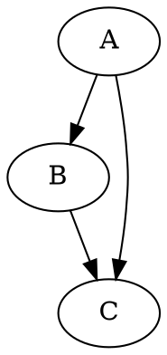

# 问题日志

<!--more-->

## IEEE754和binary32这种模式有什么区别

IEEE 754和binary32都是浮点数表示的标准。IEEE 754是一种用于表示浮点数的标准，它定义了浮点数的表示方法、运算规则等。而binary32是IEEE 754标准中的一种具体实现，也称为单精度浮点数，用32位（或4个字节）来表示一个浮点数。

主要区别在于，IEEE 754是一个标准，定义了多种浮点数的表示方式，包括单精度（binary32）、双精度（binary64）等。而binary32是这个标准中的一种特定实现，它使用32位来表示一个浮点数，其中1位表示符号位，8位表示指数，23位表示尾数。这种表示方式允许在一定范围内表示很大或很小的数字，并保持相对较高的精度。

简而言之，IEEE 754是浮点数表示的标准，而binary32是这个标准中的一种具体实现，用32位表示一个浮点数。

## IEEE754标准中都有哪些模式

IEEE 754标准定义了几种不同精度的浮点数表示方式，包括：

1. **单精度（binary32）：** 使用32位（4字节）来表示一个浮点数，其中1位表示符号，8位表示指数，23位表示尾数。

2. **双精度（binary64）：** 使用64位（8字节）来表示一个浮点数，其中1位表示符号，11位表示指数，52位表示尾数。

3. **拓展精度（extended precision）：** 使用80位或128位来表示一个浮点数，具体的位数可能因硬件和软件平台而异。这种格式在一些计算中常用，因为它提供了比双精度更高的精度。

此外，IEEE 754标准还定义了一些特殊值，包括正无穷大、负无穷大、NaN（Not a Number，表示非数值，用于表示无效的操作结果或未定义的数学运算）等。这些标准确保了在不同计算机系统之间的浮点数表示的一致性和可移植性。

## polynomial iteration翻译并解释

"Polynomial iteration" 可以翻译为 "多项式迭代"。

多项式迭代是一种数值计算方法，通常用于求解方程或寻找多项式的根。在多项式迭代中，你会从一个初始猜测值开始，然后使用多项式函数的迭代过程来逐步接近方程的解或多项式的根。这个过程会一次又一次地应用多项式函数，每次都使用上一次计算的结果作为下一次的输入，直到达到所需的精度或找到根为止。

多项式迭代在数学和工程领域中广泛应用，用于解决各种方程和问题，例如找到方程的实数或复数根，计算多项式的因子，以及进行数值优化等任务。它是数值分析和计算数学中的重要技术之一。

## conjugate gradient algorithm翻译并解释

"Conjugate Gradient Algorithm" 可以翻译为 "共轭梯度算法"。

共轭梯度算法是一种用于解决大规模线性方程组和优化问题的迭代数值算法。它通常用于解决对称正定矩阵的线性方程组，这类问题在科学和工程中经常出现，例如在计算机图形学、结构力学、机器学习等领域。

这个算法的核心思想是通过一系列迭代步骤来逼近线性方程组的解，每一步都通过利用共轭（conjugate）的方向来减小残差（residual）。共轭方向的选择保证了算法的高效性，因为它最大程度地减少了在解空间中寻找解的步骤。在每一步中，算法会更新当前解的位置，并计算一个共轭方向，然后朝着这个方向进行搜索，以最小化残差。

共轭梯度算法通常用于求解大规模稀疏矩阵的线性方程组，这些问题在许多科学和工程应用中都非常重要。它具有较好的收敛性和高效性，是解决这类问题的一种常用方法。

## 解释C++类成员函数的声明

```c++
/// \brief Copy assignment operator
  DotFormatter& operator=(const DotFormatter&) noexcept = default;
```

这是一个C++类成员函数的声明。我为你分步解释：

1. `/// \brief Copy assignment operator`
   - 这是一个Doxygen风格的注释。Doxygen是一个文档生成工具，它可以从源代码注释中生成文档。此注释说明下面的函数是一个拷贝赋值运算符。

2. `DotFormatter& operator=(const DotFormatter&) noexcept = default;`
   - `DotFormatter& operator=(const DotFormatter&)`：这是拷贝赋值运算符的声明。它接受一个常量引用`const DotFormatter&`作为参数，并返回`DotFormatter&`类型的引用，表示赋值后的对象的引用。
   - `noexcept`：这是一个C++11特性，表明此函数不会抛出异常。
   - `= default;`：这是一个C++11特性，表示使用编译器默认提供的拷贝赋值运算符的实现。也就是说，我们没有手动提供具体的实现，而是让编译器为我们生成默认的实现。

总体上，这行代码是在声明`DotFormatter`类的拷贝赋值运算符，并使用编译器默认的实现，并指明这个函数不会抛出异常。

```c++
/// \brief Move assignment operator
  DotFormatter& operator=(DotFormatter&&) noexcept = default;
```

这是一个C++类成员函数的声明，具体是声明了一个移动赋值运算符。我将为你逐步解释：

1. `/// \brief Move assignment operator`
   - 同样是一个Doxygen风格的注释，说明这是一个移动赋值运算符。

2. `DotFormatter& operator=(DotFormatter&&) noexcept = default;`
   - `DotFormatter& operator=(DotFormatter&&)`：这是移动赋值运算符的声明。它接受一个右值引用`DotFormatter&&`作为参数，并返回`DotFormatter&`类型的引用，代表赋值后的对象的引用。
   - `noexcept`：表示此函数不会抛出异常。
   - `= default;`：表示使用编译器默认提供的移动赋值运算符的实现。也就是说，没有手动提供具体的实现，而是让编译器为我们生成默认的实现。

总结：这行代码是在声明`DotFormatter`类的移动赋值运算符，并使用编译器的默认实现，并且指定这个函数不会抛出异常。移动赋值运算符通常用于实现资源的高效转移，特别是在对象间进行赋值操作时。

## C++中的移动构造函数是什么

在C++中，移动构造函数是C++11及以后版本中引入的一个新特性，它允许对象"窃取"另一个对象的资源，而不是通过复制这些资源来构造新对象。这通常用于优化临时对象的资源管理，从而提高程序的性能。

移动构造函数的核心思想是：有些对象拥有动态分配的内存或其他重要资源，当这些对象被用作临时对象或即将被销毁时，它们的资源可以安全地被其他对象获取，而不需要进行昂贵的深复制操作。

考虑一个简单的`std::string`类似的例子。一个字符串对象内部可能有一个动态分配的字符数组。当我们要从一个临时字符串对象（或即将被销毁的字符串对象）创建一个新的字符串对象时，我们可以简单地将原对象的内存指针移动到新对象，而不是复制整个字符数组。

以下是一个简化版的字符串类，展示了移动构造函数的用法：

```c++
class SimpleString {
private:
    char* data;
    size_t length;

public:
    // ... 其他构造函数和成员函数 ...

    // 移动构造函数
    SimpleString(SimpleString&& other) noexcept
        : data(other.data), length(other.length) {
        // 使原对象不再指向这块内存
        other.data = nullptr;
        other.length = 0;
    }

    // ... 其他成员函数 ...
};
```

在上述例子中，移动构造函数接受一个右值引用`SimpleString&&`，然后直接获取原字符串对象的内部指针，并将原对象的指针设置为`nullptr`，这样原对象在销毁时就不会释放这块内存。

值得注意的是，移动构造函数通常应该被标记为`noexcept`，因为它们经常用于容器的重新分配操作，而容器需要知道这些操作不会抛出异常。

总之，移动构造函数为C++提供了一个优化资源管理和对象创建的机制，特别是在涉及大量临时对象和资源转移的场景中。

## C++中的explicit关键字的作用

在C++中，`explicit`关键字是用来修饰构造函数的，确保该构造函数不会在不明确的情况下进行隐式类型转换。它的主要目的是防止意外的类型转换导致的错误。

为了更好地理解，让我们看一个例子。假设你有一个`Box`类，该类有一个接受整数参数的构造函数，表示盒子的大小：

```c++
class Box {
public:
    Box(int size) {
        // ... 实现 ...
    }
};

void displayBox(const Box& b) {
    // ... 显示盒子 ...
}
```

如果你没有使用`explicit`关键字，你可能会意外地这样使用：

```c++
displayBox(42);  // 隐式地将int转换为Box
```

在上述情况下，整数`42`被隐式地转换为一个`Box`对象，因为`Box`的构造函数允许这样的转换。

但是，这种隐式转换可能并不总是你期望的，尤其是在上述情境中，这种转换可能不够直观或容易引发错误。

为了防止这种隐式转换，你可以使用`explicit`关键字：

```c++
class Box {
public:
    explicit Box(int size) {
        // ... 实现 ...
    }
};
```

这样，以下代码就会引发编译错误，因为不允许隐式类型转换：

```c++
displayBox(42);  // 编译错误：不能隐式地将int转换为Box
```

要使用`Box`构造函数，你必须明确地进行转换：

```c++
displayBox(Box(42));  // OK
```

总之，`explicit`关键字用于防止可能导致误解或错误的隐式类型转换。使用这个关键字可以使你的代码更安全、更清晰。

## `std::ostream&`是什么

`std::ostream`是C++标准库中的一个重要类，它属于C++的输入/输出流库。`std::ostream`主要用于数据的输出操作，例如将数据写入到屏幕（通过`std::cout`）或写入到文件（通过`std::ofstream`对象）。

在你给出的代码中，`std::ostream&`是一个对`std::ostream`对象的引用。当一个函数接受一个`std::ostream&`作为参数，这意味着你可以传递任何`std::ostream`对象（或其派生类的对象）到该函数，如`std::cout`（用于控制台输出）或`std::ofstream`对象（用于文件输出）。

使用引用参数允许函数直接在提供的流上操作，而不是复制它。这也意味着在函数内部对流所做的任何操作（例如写入数据）都会直接影响到传递给它的实际流对象。

在`TextFormatter`类的`format`方法中，`std::ostream&`参数通常用于指定输出的目标，无论是屏幕、文件还是其他输出媒介。

## Graphviz是什么

Graphviz（Graph Visualization Software）是一个开源的图形可视化软件包。它用于表示结构化信息为图形和网络图。其核心组件是`dot`语言，这是一种简单的描述图的文本语言，以及众多的工具，如`dot`、`neato`、`twopi`、`circo`等，这些工具可以根据`dot`语言描述的图生成各种格式的可视化输出。

以下是一个简单的DOT语言示例，描述了一个有向图：

这描述了一个有三个节点（A、B和C）和三条边的图。

Graphviz的主要优点之一是其自动布局功能，它能够自动计算图中节点的位置，使得图看起来整洁，并突出显示图的结构，而不需要手动调整每个节点的位置。

在很多应用场景中，Graphviz都非常有用，例如编译器优化的数据流分析、网络结构可视化、软件的依赖关系分析等。

## ubuntu命令行打开图片

打开图片：
解决办法：ubuntu系统中图片有对应的默认打开程序，所以鼠标双击就可以打开图片，命令行中如果想打开图片，只要使用图片默认的程序去打开它就可以了。ubuntu提供一个命令xdg-open，此命令后面接你想打开的文件、图片、视频、音乐等，都可以。此命令就会使用默认的程序去打开后面接的文件。比如图片名为xxx.jpg，那么在命令行中输入:

```sh
xdg-open xxx.jpg
```

详情请见：[ubuntu中命令打开图片、文档、音乐、视频等_在ubuntu中输入命令显示图片-CSDN博客](https://blog.csdn.net/weixin_44493841/article/details/106093697)

## 解释并举例C++中的复制构造函数、移动构造函数、复制赋值运算符、移动赋值运算符和析构函数。

当然可以！

**1. 复制构造函数 (Copy Constructor)**
用于初始化一个对象为另一个对象的副本。
```c++
class MyClass {
public:
    MyClass(const MyClass& other) {
        // ... copy the contents from 'other' to 'this'
    }
};
```
举例:
```c++
MyClass a;
MyClass b(a);  // 使用复制构造函数
```

**2. 移动构造函数 (Move Constructor)**
用于“窃取”一个对象的资源，而非复制。
```c++
class MyClass {
public:
    MyClass(MyClass&& other) noexcept {
        // ... move the contents from 'other' to 'this'
    }
};
```
举例:
```c++
MyClass a;
MyClass b(std::move(a));  // 使用移动构造函数
```

**3. 复制赋值运算符 (Copy Assignment Operator)**
当为一个已存在的对象赋值时使用。
```c++
class MyClass {
public:
    MyClass& operator=(const MyClass& other) {
        if (this != &other) {
            // ... copy the contents from 'other' to 'this'
        }
        return *this;
    }
};
```
举例:
```c++
MyClass a, b;
a = b;  // 使用复制赋值运算符
```

**4. 移动赋值运算符 (Move Assignment Operator)**
当为一个已存在的对象赋予另一个对象的资源时使用。
```c++
class MyClass {
public:
    MyClass& operator=(MyClass&& other) noexcept {
        if (this != &other) {
            // ... move the contents from 'other' to 'this'
        }
        return *this;
    }
};
```
举例:
```c++
MyClass a, b;
a = std::move(b);  // 使用移动赋值运算符
```

**5. 析构函数 (Destructor)**
当一个对象不再被使用并需要被销毁时调用。
```c++
class MyClass {
public:
    ~MyClass() {
        // ... release any resources or cleanup
    }
};
```
举例:
```c++
{
    MyClass a;  // 当离开这个范围时，a的析构函数将被调用
}
```

注意，为了实现资源安全的管理，通常使用规则：五/三/零，即如果你定义了移动构造函数或移动赋值运算符，你应该考虑定义所有五个；如果不需要移动语义，定义复制构造函数和复制赋值运算符；如果一个类不需要自定义析构函数、复制/move操作，那么最好全部都不定义，使用编译器自动生成的版本。

## /home/zou/Documents/FIKOS/ar/src/semantic 目录下的function.cpp文件中的Function::create函数

当然可以。`Function::create`是`ikos::ar::Function`类的一个静态工厂方法。这种方法通常用于创建对象，同时隐藏实例化对象的复杂性。我们来详细分析它。

```cpp
Function* Function::create(Bundle* bundle,
                           FunctionType* type,
                           std::string name,
                           bool is_definition,
                           Intrinsic::ID intrinsic_id) {
  auto fun =
      new Function(bundle, type, std::move(name), is_definition, intrinsic_id);
  bundle->add_function(std::unique_ptr< Function >(fun));
  return fun;
}
```

以下是对该方法的逐步分析：

1. **方法定义**：此方法定义表示我们希望创建并返回一个指向`Function`对象的指针。
   - `Bundle* bundle`: 表示该函数所属的"bundle"的指针。
   - `FunctionType* type`: 函数的类型。
   - `std::string name`: 函数的名称。
   - `bool is_definition`: 这是一个布尔标志，用于表示该函数是否是一个定义（相对于只是一个声明）。
   - `Intrinsic::ID intrinsic_id`: 表示内置函数ID的枚举值。

2. **创建`Function`对象**：
   ```cpp
   auto fun = new Function(bundle, type, std::move(name), is_definition, intrinsic_id);
   ```
   这里我们使用`new`关键字动态地分配一个新的`Function`对象。同时，我们通过`std::move(name)`移动语义来传递`name`字符串，这样可以优化性能，避免不必要的字符串拷贝。

3. **添加函数到`Bundle`**：
   ```cpp
   bundle->add_function(std::unique_ptr< Function >(fun));
   ```
   这里，我们将新创建的函数对象添加到给定的"bundle"中。为了管理这个动态创建的函数对象的生命周期，我们将它封装在`std::unique_ptr`中，这是一个智能指针，当其超出作用域时，它会自动删除所指向的对象。

4. **返回创建的`Function`对象的指针**：
   ```cpp
   return fun;
   ```
   虽然我们已经把`Function`对象的所有权交给了`std::unique_ptr`，但我们仍然返回一个裸指针给调用者，以便他们可以与新创建的对象互动。需要注意的是，这种方式存在一定的风险，因为调用者可能误认为他们需要删除返回的指针。然而，由于所有权已经被`unique_ptr`管理，所以实际上调用者不应该删除这个指针。

总的来说，`Function::create`方法提供了一个创建、初始化并添加`Function`对象到相应"bundle"的方式，同时确保其生命周期得到恰当的管理。

## /home/zou/Documents/FIKOS/ar/src/semantic 目录下的Function.cpp中的Function::set_name函数

当然可以。让我们来详细分析和解释`Function::set_name`方法。

```cpp
void Function::set_name(std::string new_name) {
  // In this case, we need to notify the bundle,
  // because it keeps a map from name to functions
  ikos_assert_msg(!new_name.empty(), "name is empty");
  std::string prev_name = this->name();

  if (!new_name.empty() && this->_parent->is_name_available(new_name)) {
    this->_name = std::move(new_name);
  } else {
    this->_name = this->_parent->find_available_name(new_name);
  }

  this->_parent->rename_function(this, prev_name, this->_name);
}
```

以下是对该方法的逐步分析：

1. **方法定义**:
   `Function::set_name`方法接受一个`std::string`类型参数`new_name`，用于为`Function`对象设置一个新名称。

2. **断言检查**:
   ```cpp
   ikos_assert_msg(!new_name.empty(), "name is empty");
   ```
   使用`ikos_assert_msg`进行断言，确保传入的`new_name`不是空的。

3. **保存当前名称**:
   ```cpp
   std::string prev_name = this->name();
   ```
   在修改名称之前，首先保存当前的函数名称，以便稍后在通知"_parent"（即"bundle"）时使用。

4. **检查新名称的可用性**:
   ```cpp
   if (!new_name.empty() && this->_parent->is_name_available(new_name)) {
       this->_name = std::move(new_name);
   } else {
       this->_name = this->_parent->find_available_name(new_name);
   }
   ```
   这段代码首先检查`new_name`是否非空，并通过`is_name_available`方法询问"_parent"（即"bundle"）该名称是否可用。如果名称可用，它将使用移动语义将`new_name`赋值给`_name`，以优化性能并避免不必要的字符串拷贝。如果名称不可用，它会通过`find_available_name`方法获取一个可用的名称。

5. **通知"_parent"（即"bundle"）**:
   ```cpp
   this->_parent->rename_function(this, prev_name, this->_name);
   ```
   `_parent`（即"bundle"）似乎维护了一个从函数名称到函数的映射。因此，当函数的名称发生变化时，需要通知其"_parent"，以更新这个映射。`rename_function`方法可能会负责这个更新任务，它需要知道函数对象、之前的名称和新的名称。

总的来说，`Function::set_name`方法允许你为`Function`对象重新命名，并确保与其关联的"_parent"（即"bundle"）更新其内部的映射，以保持一致性。

## /home/zou/Documents/FIKOS/ar/src/semantic 目录下的bundle.cpp文件的Bundle类的作用

`ikos::ar::Bundle`类在`ikos`中代表了一个程序或模块的顶级容器。在许多编译器框架和程序分析工具中，这种顶级容器的概念很常见，例如在LLVM中的`Module`。以下是`Bundle`类的主要功能和作用：

1. **容纳函数和全局变量**：`Bundle`充当了存放全局变量和函数定义的容器。从提供的源代码中可以看出，`Bundle`类提供了方法来添加、查找和重命名函数和全局变量。

2. **管理名称空间**：`Bundle`提供了一些方法，如`is_name_available`和`find_available_name`，来确保函数和全局变量的名称在整个`Bundle`中是唯一的。

3. **管理内建函数（Intrinsics）**：`Bundle`提供了`intrinsic_function`方法来获取或创建特定的内建函数。内建函数通常是编译器或分析工具中预定义的特殊函数，它们具有特定的行为或用途。

4. **持有数据布局和目标三元组信息**：构造函数接受一个`DataLayout`和一个目标三元组`triple`。`DataLayout`可能描述了目标架构的数据布局信息，如字节顺序、整数大小等。目标三元组通常描述了目标平台的信息，例如其架构、供应商和操作系统。

总的来说，`ikos::ar::Bundle`类是整个程序分析表示（Program Analysis Representation, AR）的根，存储了所有的全局变量、函数、以及与目标平台相关的信息。这使得分析工具可以在一个集中的位置访问和处理整个程序的信息。

## /home/zou/Documents/FIKOS/ar/src/semantic 目录下的bundle.cpp文件提供的intrinsic_function函数

当然可以。从您提供的`bundle.cpp`文件中，我们可以看到`Bundle`类提供了两个`intrinsic_function`方法。以下是这两个方法的分析：

### 1. `Function* Bundle::intrinsic_function(Intrinsic::ID id)`

**参数**：

- `Intrinsic::ID id`: 一个枚举类型，表示特定的内建函数。

**功能**：

- 首先，该方法使用`Intrinsic::long_name(id)`来获取内建函数的名称。
- 然后，它尝试在当前的`Bundle`中查找这个名称的函数。
- 如果找到，它就直接返回这个函数。
- 如果没有找到，它会使用`Intrinsic::type(this, id)`来获取函数的类型，并使用`Function::create`方法来创建一个新的函数，并添加到`Bundle`中。

### 2. `Function* Bundle::intrinsic_function(Intrinsic::ID id, Type* template_ty)`

**参数**：
- `Intrinsic::ID id`: 一个枚举类型，表示特定的内建函数。
- `Type* template_ty`: 一个额外的类型参数，某些内建函数可能会需要它。

**功能**：
- 类似于上一个方法，但是这个版本考虑了额外的类型参数`template_ty`。
- 使用`Intrinsic::long_name(id, template_ty)`来获取带有类型参数的内建函数的名称。
- 然后进行相同的查找或创建函数的操作。

**总结**：
`intrinsic_function`方法允许用户在`Bundle`中获取或创建特定的内建函数。这些内建函数在编译器和程序分析工具中通常是预定义的，并且它们具有特定的预期行为。例如，某些内建函数可能会表示特定的数学操作、内存操作或其他特殊的行为。

这两个版本的方法基本上执行相同的逻辑，只是其中一个版本额外处理了类型参数。这种模式在编译器和程序分析工具中很常见，因为一些内建函数可能会根据不同的类型参数有不同的行为或表示。

## /home/zou/Documents/FIKOS/ar/ar/semantic 目录下的instrinc.hpp文件分析

`ikos::ar::Intrinsic`类在`ikos`中似乎是用来管理和访问内建函数的。这些内建函数为编译器或分析工具提供了特定的、预定义的功能。

以下是对该类定义的详细分析：

### 1. 枚举`Intrinsic::ID`

这是一个枚举类型，定义了所有可用的内建函数。从列表中我们可以看到，这些函数大致可以分为几个分类：
- IKOS特定的内建函数：如`IkosAssert`、`IkosAssume`等。
- Libc函数：这些是C标准库函数的表示，如`LibcMalloc`、`LibcFree`、`LibcPrintf`等。
- Libcpp函数：这些代表C++库函数，如`LibcppNew`和`LibcppDelete`。

### 2. 常量`Prefix`

定义了内建函数名称的前缀，其值为`"ar."`。

### 3. 类方法

- `FunctionType* type(Bundle*, ID)`: 从内建函数的ID获取其类型。
  
- `FunctionType* type(Bundle*, ID, Type*)`: 对于需要类型参数的内建函数，获取其类型。

- `std::string short_name(ID)`: 根据内建函数的ID获取其简短名称。

- `std::string short_name(ID, Type*)`: 对于需要类型参数的内建函数，获取其简短名称。

- `std::string long_name(ID)`: 根据内建函数的ID获取其完整名称，这通常是简短名称与前缀的组合。

- `std::string long_name(ID, Type*)`: 对于需要类型参数的内建函数，获取其完整名称。

### 总结

`ikos::ar::Intrinsic`类为`ikos`提供了一种方法来识别、访问和管理内建函数。这些函数是预定义的，并且在编译或分析期间具有特定的预期行为。通过这个类，工具可以轻松地查询和使用这些函数，无需每次都定义它们。

该类还提供了方法来获取内建函数的名称和类型，这使得工具可以在不知道特定内建函数的确切信息的情况下与其交互。

如果您有关于这个类或其他方面的任何其他问题，请告诉我。

## /home/zou/Documents/FIKOS/ar/src/semantic 目录下的intrinsic.hpp文件中的Intrinsic类也包含分类

是的，`Intrinsic`类中的`ID`枚举确实有分类，我们可以从枚举值的命名看到。以下是这些分类的简要说明：

1. **IKOS特定的内建函数**：
   - 由`_BeginIkosIntrinsic`和`_EndIkosIntrinsic`包围。
   - 这些内建函数与IKOS的分析功能直接相关，例如`IkosAssert`、`IkosAssume`和`IkosNonDet`。

2. **Libc函数**：
   - 由`_BeginLibcIntrinsic`和`_EndLibcIntrinsic`包围。
   - 这些函数代表C语言标准库中的函数。例如，`LibcMalloc`、`LibcFree`和`LibcPrintf`。
   - 它们覆盖了各种标准C库功能，包括内存管理、文件I/O、字符串处理等。

3. **Libcpp函数**：
   - 由`_BeginLibcppIntrinsic`和`_EndLibcppIntrinsic`包围。
   - 这些函数代表C++标准库中的功能，如`LibcppNew`、`LibcppDelete`，以及异常处理函数如`LibcppThrow`和`LibcppBeginCatch`。

这种分类方式提供了一种结构化的方法来组织和理解这些内建函数，这对于开发者和用户来说都是有用的，因为它们可以根据功能或用途快速找到特定的内建函数。

## /home/zou/Documents/FIKOS/ar/src/semantic 目录下的intrinsic.cpp文件中的template_ty是什么

在您给出的代码片段和函数签名`std::string Intrinsic::short_name(ID id, Type* template_ty)`中，`template_ty`是一个指向`Type`的指针。从名字和上下文来看，这个参数可能是用来表示某些内建函数短名称中的模板类型。

例如，前面的列表中有像`ikos.nondet.(type)`这样的短名称。在这里，`(type)`可能是一个占位符，它将根据`template_ty`的实际类型来替换。假设`Type`类可以代表例如`int`、`float`等类型，那么`ikos.nondet.(type)`可能会被替换为`ikos.nondet.int`、`ikos.nondet.float`等。

这样的设计可以让内建函数名字更具描述性，同时根据实际类型动态生成。在处理涉及模板或泛型的情况时，这样的设计是非常有用的。

## /home/zou/Documents/FIKOS/ar/src/semantic 目录下的intrinsic.cpp文件中的case IkosNonDet是什么

这行代码是`Intrinsic::short_name`函数中的一部分，它是处理`IkosNonDet`情况的。

`IkosNonDet`似乎代表某种不确定的或非确定性的内建函数。当需要为这种函数生成短名称时，这个代码片段会根据提供的`template_ty`（一个代表某种类型的`Type`指针）生成名称。

函数`template_type_name(template_ty)`会返回`template_ty`的短名称字符串。这个名称随后会被拼接到`"ikos.nondet."`字符串后面。

例如，如果`template_ty`代表了整数类型（假设其名称为`int`），则上述代码会返回字符串`"ikos.nondet.int"`。这提供了一种动态生成描述性名称的方法，该名称基于内建函数的种类以及其操作的数据类型。

## /home/zou/Documents/ikos/core/include/ikos/core/support目录下的assert.hpp文件

这个`assert.hpp`文件定义了三个宏：`ikos_assert`、`ikos_assert_msg` 和 `ikos_unreachable`。这些宏的主要目的是帮助开发者在调试模式下检测问题，并在发布模式下确保没有额外的运行时开销。

1. **ikos_assert(expr)**: 这个宏用于断言一个表达式为真。如果在调试模式下（即NDEBUG未定义）该表达式为假，程序将中断。在发布模式下，这个宏没有任何效果。

2. **ikos_assert_msg(expr, msg)**: 这个宏与`ikos_assert`相似，但它还允许您提供一个错误消息。如果表达式为假，那么这个消息将与错误一起显示。同样，在发布模式下，这个宏没有任何效果。

3. **ikos_unreachable(msg)**: 这个宏标记了不应该达到的代码位置。如果这个位置被达到了，那么在调试模式下，它会导致一个断言失败。在发布模式下，根据编译器的支持，它可能会提供一个优化器提示，表示当前位置不可达，或者调用abort()函数来中断程序。

当NDEBUG宏被定义（通常在发布模式下），`ikos_assert`和`ikos_assert_msg`宏的实际效果就是不执行任何操作。而`ikos_unreachable`宏则可能提供一个给优化器的提示或调用abort()函数，具体取决于编译器的支持。

在调试模式下，这些宏使用了标准的`assert`函数来实现其断言功能。

## #undef怎么用

`#undef` 是 C 和 C++ 预处理器的一个指令，用于取消之前定义的宏。这意味着，当你使用 `#undef` 指令后，该宏的定义将被移除，它将不再是一个已定义的宏，直到再次被 `#define` 定义。

这里是一个简单的 `#undef` 使用示例：

```cpp
#define MY_MACRO 100

#include <iostream>

int main() {
    std::cout << MY_MACRO << std::endl; // 输出 100

    #undef MY_MACRO
    // 此时，MY_MACRO 不再被定义

    // 下面的代码将会引发编译错误，因为 MY_MACRO 已经未定义
    // std::cout << MY_MACRO << std::endl;
    
    #define MY_MACRO 200
    std::cout << MY_MACRO << std::endl; // 输出 200
}

```

`#undef` 的常见用途：

1. **移除宏定义**：有时，为了确保某个宏不会与其他代码冲突，或者确保在某个特定的区域中，该宏没有定义，你可能希望取消它的定义。
2. **重新定义宏**：如果你想给一个宏赋予一个新的值或定义，你首先需要取消它的原始定义，然后再重新定义它。

请注意，经常使用 `#undef` 可能会使代码难以阅读和维护，因为它可能会导致预期之外的宏行为，所以应该谨慎使用。

## #ifndef怎么用

`#ifndef` 是 C 和 C++ 预处理器的一个指令，它用于检查一个宏是否未被定义。如果该宏未被定义，则执行后续的预处理器指令，直到遇到对应的 `#endif`。

`#ifndef` 常常与 `#define` 一起使用，来避免头文件的多重包含。这种方法被称为 "include guards" 或 "header guards"。

下面是如何使用 `#ifndef` 的一个简单示例：

```cpp
// 文件：example_header.h

#ifndef EXAMPLE_HEADER_H
#define EXAMPLE_HEADER_H

// 头文件的内容
int my_function();

#endif // EXAMPLE_HEADER_H
```

这里的工作原理是：

1. 当这个头文件第一次被包含时，`EXAMPLE_HEADER_H` 还没有定义，所以 `#ifndef EXAMPLE_HEADER_H` 为真，预处理器会继续处理直到 `#endif`。
2. 在这个过程中，`#define EXAMPLE_HEADER_H` 将会执行，这样 `EXAMPLE_HEADER_H` 就被定义了。
3. 如果在后面的代码中再次包含这个头文件，`EXAMPLE_HEADER_H` 已经被定义，因此 `#ifndef EXAMPLE_HEADER_H` 为假，预处理器就会跳过整个块，直到 `#endif`。

这种方法有效地避免了由于多次包含相同的头文件而导致的重复定义。

## #ifdef怎么用

`#ifdef` 是 C 和 C++ 预处理器的一个指令，用于检查一个宏是否已经被定义。如果该宏已定义，那么 `#ifdef` 和其后的代码（直到相应的 `#endif`）之间的代码将会被包含在编译中。否则，该段代码会被忽略。

以下是一个简单的使用 `#ifdef` 的示例：

```cpp
#include <iostream>

#define USE_HELLO

int main() {
    #ifdef USE_HELLO
        std::cout << "Hello, World!" << std::endl;
    #else
        std::cout << "Hi, World!" << std::endl;
    #endif

    return 0;
}
```

在上述代码中，因为宏 `USE_HELLO` 已经被定义，所以程序将输出 "Hello, World!"。如果你注释掉 `#define USE_HELLO` 这一行，程序则会输出 "Hi, World!"。

`#ifdef` 的常见用途：

1. **平台或编译器特定的代码**：可以根据不同的平台或编译器定义不同的宏，然后使用 `#ifdef` 来编写特定于该平台或编译器的代码。

2. **功能切换**：在开发过程中，你可能想要在不同的版本或构建选项之间切换某些功能。通过定义或不定义某个宏，可以轻松地启用或禁用特定的代码段。

3. **头文件保护**：为了防止一个头文件被多次包含，可以使用 `#ifdef`、`#define` 和 `#endif` 的组合来确保头文件的内容只被包含一次。

除了 `#ifdef`，还有 `#ifndef` 指令，它的作用是检查一个宏是否*没有*被定义。如果该宏未定义，那么 `#ifndef` 和其后的代码（直到相应的 `#endif`）之间的代码将会被包含在编译中。

## /home/zou/Documents/ikos/ar/include/ikos/semantic 目录下的type.hpp文件

这是`type.hpp`文件的内容概要，它定义了IKOS (Interval-based Klee Open Solver) 中的各种类型。

1. **头文件和前置声明**:
   - 包含了标准库头文件、其他IKOS组件等。
   - 定义了一些前置声明，比如`Bundle`和`Context`。

2. **FloatSemantic枚举**: 描述了不同的浮点数语义，如半精度、单精度、双精度等。

3. **Type类**:
   - 基类，表示所有类型。
   - 定义了类型的各种种类，如整型、浮点型、指针类型、结构体类型等。
   - 提供了一系列的方法来查询特定类型的信息。

4. **VoidType类**: 表示C语言中的`void`类型。

5. **ScalarType类**: 表示标量类型的基类，如整型、浮点型和指针。

6. **IntegerType类**: 
   - 表示整数类型。
   - 除了基本的整数类型，还支持不同的位宽和符号性。

7. **FloatType类**: 表示浮点类型，支持不同的浮点语义。

8. **PointerType类**: 表示指针类型，具有指向的类型属性。

9. **AggregateType类**: 是StructType, ArrayType, VectorType和OpaqueType的基类。

10. **StructType类**: 
   - 表示结构体类型。
   - 可以包含多个字段，每个字段有一个偏移量和一个类型。

11. **SequentialType类**: 是数组和向量类型的基类。

12. **ArrayType类**: 表示数组类型。

13. **VectorType类**: 表示向量类型。

14. **OpaqueType类**: 表示不透明类型，主要用于表示C中的前向声明结构。

15. **FunctionType类**: 表示函数类型，具有返回类型和参数类型。

这个文件为IKOS提供了一个类型系统，可以表示大多数在中间表示(IR)中常见的类型。这些类型包括标量类型、聚合类型(如结构体和数组)以及函数类型。

## /home/zou/Documents/ikos/ar/include/ikos/semantic 目录下的type.hpp文件中的FloatType类的分析

当然可以。下面是对`FloatType`类的详细分析：

```cpp
/// \brief Floating point type
///
/// Represents any floating point type, with its bit-width and semantic.
///
/// See `FloatSemantic`.
class FloatType final : public ScalarType {
private:
  // Bit width
  uint64_t _bit_width;

  // Float semantic
  FloatSemantic _float_sem;

private:
  /// \brief Private constructor
  FloatType(uint64_t bit_width, FloatSemantic float_sem);

public:
  /// \brief Static constructor
  static FloatType* get(Context& ctx, FloatSemantic float_sem);

  /// \brief Get the bit width
  uint64_t bit_width() const { return this->_bit_width; }

  /// \brief Get the float semantic
  FloatSemantic float_semantic() const { return this->_float_sem; }

  /// \brief Dump the type for debugging purpose
  void dump(std::ostream&) const override;

  /// \brief Method for type support (isa, cast, dyn_cast)
  static bool classof(const Type* t) { return t->kind() == FloatKind; }

  // friends
  friend class ContextImpl;

}; // end class FloatType
```

`FloatType`类表示浮点数类型，并从`ScalarType`类继承。

1. **私有成员变量**:
   - `_bit_width`: 一个`uint64_t`类型，表示该浮点类型的位宽。
   - `_float_sem`: 一个`FloatSemantic`枚举类型，表示浮点数的语义，如单精度、双精度等。

2. **私有构造函数**:
   - `FloatType(uint64_t bit_width, FloatSemantic float_sem)`: 它是一个私有构造函数，这意味着不能直接实例化`FloatType`对象。它需要两个参数：位宽和浮点数语义。

3. **公共方法**:
   - `static FloatType* get(Context& ctx, FloatSemantic float_sem)`: 静态构造函数，使用给定的浮点数语义从上下文中获取或创建一个`FloatType`对象。
   - `uint64_t bit_width() const`: 返回该浮点类型的位宽。
   - `FloatSemantic float_semantic() const`: 返回浮点数的语义。
   - `void dump(std::ostream&) const override`: 用于调试目的，将类型信息转储到输出流中。
   - `static bool classof(const Type* t)`: 用于类型支持，检查给定的类型`t`是否为`FloatType`。

4. **友元类**:
   - `friend class ContextImpl`: 这使得`ContextImpl`类可以访问`FloatType`的私有和受保护的成员。

总的来说，`FloatType`类为IKOS提供了对不同浮点数语义的支持，如半精度、单精度、双精度等，每种浮点数语义都有相应的位宽。

## /home/zou/Documents/ikos/ar/include/ikos/semantic 目录下的type.hpp文件中的FloatSemantic类型

`FloatSemantic`是一个枚举类型，用于表示浮点数的不同语义。从你给出的代码中，我们可以看到以下定义：

```cpp
/// \brief Floating point semantic
enum FloatSemantic { Half, Float, Double, X86_FP80, FP128, PPC_FP128 };
```

下面是各个枚举值的解释：

1. **Half**: 半精度浮点数。它通常使用16位表示，其中有1位符号位、5位指数和10位尾数。

2. **Float**: 单精度浮点数。它通常使用32位表示，其中有1位符号位、8位指数和23位尾数。这是C/C++中的`float`类型。

3. **Double**: 双精度浮点数。它通常使用64位表示，其中有1位符号位、11位指数和52位尾数。这是C/C++中的`double`类型。

4. **X86_FP80**: 这是x86架构特有的80位扩展精度浮点数。通常有1位符号位、15位指数和64位尾数。

5. **FP128**: 128位四倍精度浮点数。具体的位分配可能因实现而异。

6. **PPC_FP128**: 这是PowerPC架构特有的128位双倍精度浮点数。

该枚举用于区分不同的浮点数表示，尤其是当需要确切知道浮点数的位宽和语义时，例如在代码生成、优化或分析中。

## /home/zou/Documents/ikos/ar/include/ikos/semantic 目录下的type.cpp中的Type::is_unsigned_integer函数

这是`Type`类中的`is_unsigned_integer()`方法的实现。该方法的目的是检查一个`Type`对象是否代表一个无符号整数类型。

让我们一步步地分析这个方法：

1. `isa< IntegerType >(this)`:
   - 这是一个模板函数，检查`this`对象是否是`IntegerType`类的一个实例。换句话说，它检查这个`Type`对象是否代表一个整数类型。

2. `cast< IntegerType >(this)->is_unsigned()`:
   - 如果`this`对象是一个`IntegerType`的实例，`cast< IntegerType >(this)`会将`this`对象安全地转换为`IntegerType`的指针。
   - `is_unsigned()`是`IntegerType`类的一个方法，它检查这个整数类型是否是无符号的。

3. 组合上面两个表达式，我们得到：
   - 如果这个`Type`对象是一个`IntegerType`的实例，并且它是无符号的，那么这个方法返回`true`，否则返回`false`。

总之，这个方法检查给定的`Type`对象是否代表一个无符号整数类型。如果是，返回`true`，否则返回`false`。
